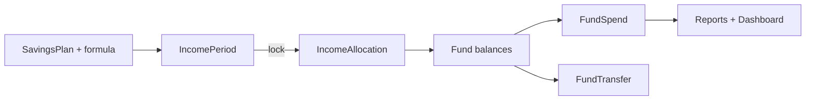
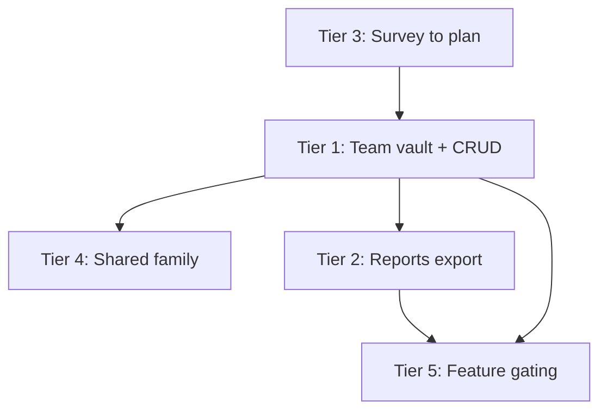

# Kinsenas Feature Roadmap — Overview

Kinsenas is a **payday allocation / envelope-fund planner** ("Sweldo with a plan"), not a generic expense tracker. New work should deepen allocation literacy, not replace the fund-based model with a transaction ledger.

## Core loop (today)

## Tier plans

| Tier | Plan file | Theme | Suggested phase |
|------|-----------|-------|-----------------|
| 1 | [20260801-2112-tier-1-improve-existing-plan.md](./20260801-2112-tier-1-improve-existing-plan.md) | Polish core loop | Phase A (1–2 sprints) |
| 2 | [20260801-2112-tier-2-envelope-model-plan.md](./20260801-2112-tier-2-envelope-model-plan.md) | Bills, debt, goals, rollover | Phase B (2–4 sprints) |
| 3 | [20260801-2112-tier-3-financial-literacy-plan.md](./20260801-2112-tier-3-financial-literacy-plan.md) | Survey→plan, lessons, i18n | Phase C (strategic) |
| 4 | [20260801-2112-tier-4-team-family-plan.md](./20260801-2112-tier-4-team-family-plan.md) | Shared payday, family flows | Phase C (depends on Tier 1 team vault) |
| 5 | [20260801-2112-tier-5-platform-monetization-plan.md](./20260801-2112-tier-5-platform-monetization-plan.md) | Pricing, tiers, PWA | Ongoing / parallel |

## Cross-tier dependencies

## What to avoid (all tiers)

- Full double-entry transaction ledger (Mint-style)
- Bank statement import / Open Banking (PH fragmented; defer)
- Merchant auto-categorization / OCR (defer)
- Multi-currency (PH-first is the moat)
- Monthly budgets that ignore payday rhythm

## Impact checklist (every tier implementation)

| Area | Ask |
|------|-----|
| Database | New tables/columns? FK changes? Data backfill? |
| Models & relationships | New models? Factory states? |
| Seeders & demo data | `migrate:fresh --seed` still usable? Order? Idempotent? |
| Enums & permissions | Roles, subscription features, policies? |
| Routes & Wayfinder | New routes → TS regen? |
| Form requests & validation | New/changed fields? Authorization? |
| Services & events | Business logic? Queued jobs? |
| Inertia props & TS types | Prop shape changes in `resources/js/types/`? |
| UI components | Which pages consume changed props? |
| Print / export / reports | Same data shown elsewhere? |
| Tests | Feature tests under `tests/Feature/Savings/` |

## Suggested execution order

**Phase A:** Tier 1 (except team vault if blocked)  
**Phase B:** Tier 2 items in order — recurring obligations → goal targets → rollover → spend tags → charts/export  
**Phase C:** Tier 1 team vault → Tier 4 → Tier 3 survey bridge → Tier 3 i18n  
**Parallel:** Tier 5 pricing UX when billing mode goes live

Pick a tier plan file to expand into an implementation breakdown when ready to ship.
