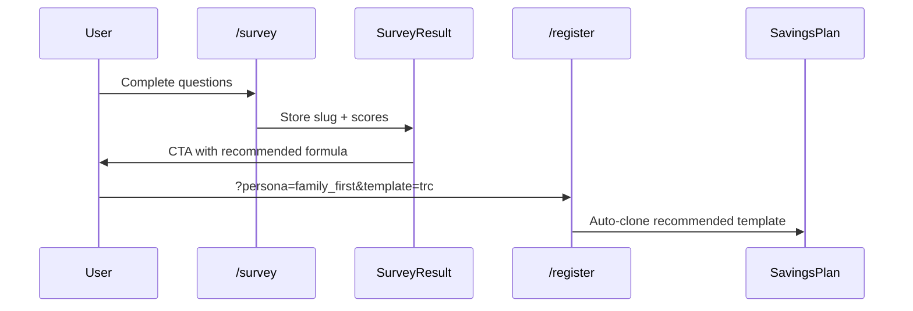

# Tier 3 — Financial Literacy & Personalization

Parent: [20260801-2112-feature-roadmap-overview-plan.md](./20260801-2112-feature-roadmap-overview-plan.md)

## Problem

Kinsenas has strong **top-of-funnel** literacy (landing formulas, multi-language survey, guidance CMS) but the **logged-in app** is English-only and disconnected from survey personas. Users who complete the survey get a result slug ([`SurveyResultSlug`](../../app/Enums/SurveyResultSlug.php)) that never influences their plan choice or dashboard.

---

## 3.1 Survey → plan recommendation

### Flow



### Data model

| Option | Fields |
|--------|--------|
| A — on user | `users.survey_result_slug`, `users.recommended_template_id` |
| B — link survey response | `survey_responses.user_id` on register match by email/session |

Existing: [`SurveyResponse`](../../app/Models/SurveyResponse.php), [`SurveyResponseController`](../../app/Http/Controllers/Marketing/SurveyResponseController.php)

### Persona → template mapping (config)

| Persona | Suggested template |
|---------|-------------------|
| FamilyFirstPlanner | TRC or custom family weights |
| FaithGivingPlanner | Abundant (tithe emphasis) |
| GoalBuilder | TRC (Emancipation/Emergency) |

Store mapping in `config/survey.php` or database.

### Backend

- [`CreateNewUser`](../../app/Actions/Fortify/CreateNewUser.php) or post-register listener — clone plan if `recommended_template_id` present
- [`SavingsPlanService::cloneFromTemplate()`](../../app/Services/Savings/SavingsPlanService.php)

### Frontend

- [`survey-result.tsx`](../../resources/js/components/survey/survey-result.tsx) — "Start with this plan" links to register with query params
- [`register.tsx`](../../resources/js/pages/auth/register.tsx) — show recommended formula banner

### Tests

- Register with persona param → plan exists with correct template categories

---

## 3.2 In-app micro-lessons

Not a full LMS — contextual education blocks.

### Content types

| Lesson | Where | Source |
|--------|-------|--------|
| Why lock income? | Income show page, first lock | Extend [`SavingsPlanPageGuidance`](../../app/Models/SavingsPlanPageGuidance.php) or new `EducationSnippet` model |
| Formula comparison | Plan chooser | Reuse [`landing-formula-section.tsx`](../../resources/js/components/marketing/landing-formula-section.tsx) patterns |
| Payday checklist | Dashboard, printable | Static markdown → PDF export or print CSS |

### Admin

- Optional: admin CRUD for snippets (similar to savings guidance)
- Or: seed-only content v1

### Payday checklist PDF

Steps: Lock income → Transfer to banks → Log first spend → Review fund health

- Blade or React print view
- No `php artisan` in member docs — operator guide in admin if needed

---

## 3.3 Persona-based dashboard nudges

Extend [`DashboardSummaryService`](../../app/Services/Dashboard/DashboardSummaryService.php) to return `nudges[]`:

| Persona | Nudge example |
|---------|---------------|
| FamilyFirstPlanner | "Add a family support recipient" |
| FaithGivingPlanner | "Assign tithe fund to bank" |
| GoalBuilder | "Set a target on Emergency fund" (ties to Tier 2 goals) |

UI: dismissible cards on [`dashboard.tsx`](../../resources/js/pages/dashboard.tsx)

---

## 3.4 Localized UI (Tagalog / Cebuano)

Survey already has trilingual content in [`survey-content.ts`](../../resources/js/lib/survey/survey-content.ts).

### Approach

1. Create `resources/js/lib/i18n/` with locale files (`en.ts`, `tl.ts`, `ceb.ts`)
2. User preference: `locale` on user or browser default
3. Phase 1 strings: setup checklist, plan guidance, income lock labels, error toasts
4. Phase 2: full savings pages

### Backend

- Share `locale` in [`HandleInertiaRequests`](../../app/Http/Middleware/HandleInertiaRequests.php)
- Validation messages: Laravel lang files `lang/tl/`, `lang/ceb/`

### Settings

- Language picker in [`settings/profile.tsx`](../../resources/js/pages/settings/profile.tsx) or appearance

### Out of scope v1

- Admin UI translation
- RTL or non-PH locales

---

## Impact checklist

| Area | Tier 3 touch |
|------|--------------|
| Database | `users.survey_result_slug`, optional `education_snippets`, `users.locale` |
| Seeders | Persona-template mapping, education snippets |
| Routes | Survey result deep link; optional `/savings/checklist/print` |
| TS types | `SurveyPersona`, `DashboardNudge`, locale type |
| Docs | Member doc for payday checklist (if user requests) |

---

## Dependencies

- Tier 2 savings goals enhance GoalBuilder nudges
- Tier 1 payday wizard overlaps with checklist — coordinate UX

## Suggested test commands (manual)

```bash
php artisan test --compact tests/Feature/Marketing/
php artisan test --compact tests/Feature/Auth/RegistrationTest.php
npm run build
```

## Visual QA

1. Complete survey as FamilyFirst persona → register → plan pre-selected
2. Dashboard shows persona nudge
3. Switch language to Tagalog → checklist labels update
4. Print payday checklist from dashboard
