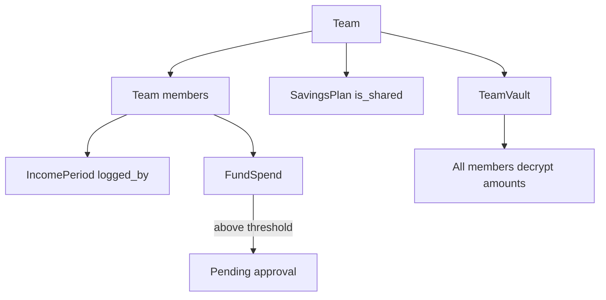

# Tier 4 — Team and Family Features

Parent: [20260801-2112-feature-roadmap-overview-plan.md](./20260801-2112-feature-roadmap-overview-plan.md)

## Problem

Survey targets **couples/families managing shared money** ([`survey-content.ts`](../../resources/js/lib/survey/survey-content.ts) Q1/Q2). Today:

- One plan per `(team_id, created_by_user_id)` — only the creator has a plan
- Shared plans use creator's vault DEK — members can't decrypt without team vault
- Team roles ([`TeamRole`](../../app/Enums/TeamRole.php)) have no savings-specific permissions
- No approval workflow for large family spends

---

## 4.1 Shared plan visibility

### Prerequisite

**Tier 1 team vault** — [`TeamVault`](../../app/Models/TeamVault.php) created when team enables shared finances; all members unwrap team DEK after unlock.

### Authorization

Extend [`SavingsPlanPolicy`](../../app/Policies/SavingsPlanPolicy.php):

| Actor | View | Edit plan | Log income | Spend |
|-------|------|-----------|------------|-------|
| Plan creator | yes | yes | yes | yes |
| Team owner/admin | yes | if shared | yes | yes |
| Team member | yes if `is_shared` | no | optional (see 4.5) | yes if allowed |

Plan flag exists: sharing via plan update ([`SavingsPlanController`](../../app/Http/Controllers/Savings/SavingsPlanController.php)).

### Frontend

- Shared badge on [`plan.tsx`](../../resources/js/pages/savings/plan.tsx)
- Read-only mode for members without edit permission

---

## 4.2 Spend approval workflow

### Target model

```
Team (or SavingsPlan) settings
  spend_approval_threshold (encrypted money, nullable)
  require_approval_for_members: bool
```

When member creates spend ≥ threshold → status `pending_approval` (new enum value or reuse pending).

Team owner/admin confirms/rejects from [`PendingActionsPanel`](../../resources/js/components/dashboard/pending-actions-panel.tsx).

### Services

- [`FundSpendService`](../../app/Services/Savings/FundSpendService.php) — set status based on actor + threshold
- Notification to admins on pending approval

### Permissions

New [`TeamPermission`](../../app/Enums/TeamPermission.php) cases: `ApproveSpends`, `ManageSharedPlan`

---

## 4.3 Family recipient presets

Low-effort UX win — no schema change required.

### Seeder / defaults

On team create or first visit to Recipients:

- Suggested: "Family support", "Nanay/Tatay", "Anak — tuition", "Household utilities"
- Quick-add buttons on [`recipients/index.tsx`](../../resources/js/pages/savings/recipients/index.tsx)

### Optional model

```
RecipientTemplate (system-wide or per-team)
  name, recipient_type, sort_order
```

---

## 4.4 Per-member income logging

### Schema challenge

Current unique constraint: one plan per `(team_id, created_by_user_id)`.

**Option A — one shared team plan**

- Drop per-user plan constraint; one `SavingsPlan` per team with `is_team_plan = true`
- Migration: merge duplicate plans or pick owner plan

**Option B — income attribution only**

- Keep one shared plan (creator's)
- [`IncomePeriod`](../../app/Models/IncomePeriod.php) adds `logged_by_user_id`
- Each member adds their sweldo as separate income periods on the same plan

Option B is smaller diff and aligns with Tier 2 multi-source income.

### UI

- Income index shows who logged each period
- Filter "my income" vs "all"

---

## Architecture (target state)



---

## Impact checklist

| Area | Detail |
|------|--------|
| **Database** | Team vault usage; optional approval threshold columns; `income_periods.logged_by_user_id` |
| **Policies** | SavingsPlanPolicy, new spend approval policy |
| **Enums** | SpendStatus or TransferStatus extension for `pending_approval` |
| **Middleware** | Ensure team member can access shared plan routes |
| **Notifications** | Approval request to team admins |
| **Seeders** | Family team demo with two members + shared plan |
| **Tests** | Member cannot edit plan; admin approves spend; decrypt with team vault |

---

## Dependencies

| Dependency | Tier |
|------------|------|
| Team vault implementation | Tier 1 |
| Multi-source income (optional) | Tier 2 |
| Notifications infrastructure | Tier 1 |

---

## Out of scope (Tier 4)

- Split expenses between members (settlements)
- Separate plans per child
- Joint bank account sync

---

## Suggested test commands (manual)

```bash
php artisan test --compact tests/Feature/Teams/
php artisan test --compact tests/Feature/Savings/
php artisan test --compact tests/Feature/Savings/FundSpendTest.php
```

## Visual QA

1. Create team with two members; share plan; second member unlocks team vault
2. Member logs income → visible on shared income list
3. Member spends above threshold → admin sees pending approval
4. Admin approves → spend confirmed, balances update
