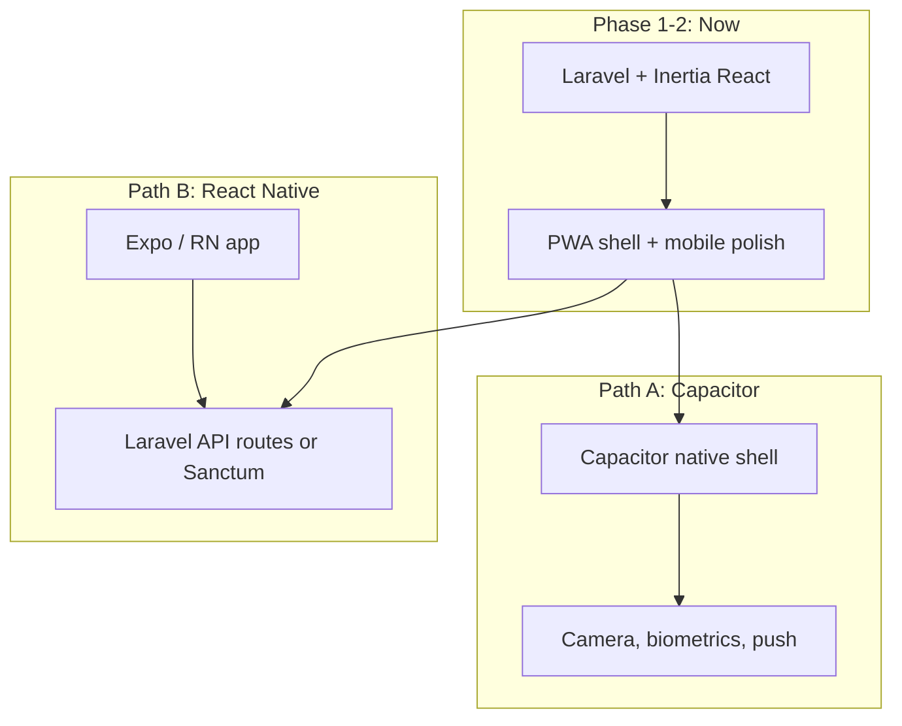
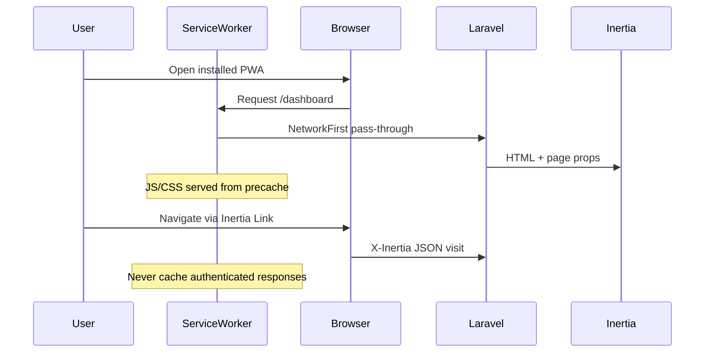

# PWA exploration and mobile bridge plan

Parent: [20260801-2112-tier-5-platform-monetization-plan.md](./20260801-2112-tier-5-platform-monetization-plan.md) (section 5.4)

## Current state

**PWA readiness: ~5%.** The app has viewport meta and a single `apple-touch-icon` in [`resources/views/app.blade.php`](../../resources/views/app.blade.php), but no web manifest, service worker, install UX, or PWA build tooling.

**Mobile UX readiness: solid foundation.** The authenticated shell already uses a Sheet-based sidebar below 768px ([`resources/js/components/ui/sidebar.tsx`](../../resources/js/components/ui/sidebar.tsx)), `min-h-svh`/`dvh` layouts, and at least one domain-specific mobile pattern (income cards vs table in [`resources/js/pages/savings/income/index.tsx`](../../resources/js/pages/savings/income/index.tsx)).

**Gaps blocking a credible “Add to Home Screen” experience:**
- Referenced brand PNGs (`/kinsenas-square-logo.png`) are not in tracked [`public/`](../../public/) — only `favicon.svg` exists
- Mobile sidebar does not auto-close after navigation ([`resources/js/components/nav-main.tsx`](../../resources/js/components/nav-main.tsx))
- No `safe-area-inset` padding for notched phones in standalone mode
- Several data-heavy surfaces still rely on horizontal scroll (e.g. [`resources/js/components/savings/plan-guidance-panels.tsx`](../../resources/js/components/savings/plan-guidance-panels.tsx))
- No install prompt or iOS “Share → Add to Home Screen” guidance

This expands Tier 5 item **mobile-pwa** with your chosen scope: **full mobile polish before install prompt**.

---

## Strategic framing: PWA vs future native app

You are undecided on native — recommend a **PWA-first bridge** that de-risks both paths:



| Path | When it fits | What PWA work reuses |
|------|--------------|----------------------|
| **Capacitor** | Keep Inertia/React UI; need App Store presence quickly | Manifest, icons, mobile layouts, SW asset caching — nearly 100% |
| **React Native** | Want native navigation/animations; willing to rebuild UI | Mobile UX patterns, API contracts, icon assets — ~30% |
| **PWA only** | Web install is enough for beta/PH market | Everything in this plan |

**Recommendation:** Ship PWA + mobile polish first. After 4–8 weeks of real mobile usage data, choose Capacitor (lower cost, same codebase) unless you hit hard limits (background sync, complex native UX, App Store policy issues).

---

## Phased implementation

### Phase A — Mobile UX polish (prerequisite; no PWA yet)

Goal: The app feels intentional on a phone **before** asking users to install.

| Task | Files / approach |
|------|------------------|
| Auto-close mobile sidebar on nav | Extend [`nav-main.tsx`](../../resources/js/components/nav-main.tsx) (and admin nav if needed) to call `setOpenMobile(false)` from `useSidebar()` on link click |
| Safe-area padding in standalone + mobile | Add utilities in [`resources/css/app.css`](../../resources/css/app.css) (`padding-top: env(safe-area-inset-top)` on header/sheet); apply in [`app-sidebar-header.tsx`](../../resources/js/components/app-sidebar-header.tsx) and [`survey-shell.tsx`](../../resources/js/components/survey/survey-shell.tsx) |
| Mobile layout audit — priority pages | Dashboard, spending, transfers, reports, plan guidance, billing QR, vault unlock |
| Pattern to follow | Reuse income index card/table split where tables are primary |
| Receipt upload | Already uses `pointer: coarse` in [`receipt-upload-field.tsx`](../../resources/js/components/savings/receipt-upload-field.tsx) — verify in standalone Safari/Chrome |

**Out of scope for Phase A:** Admin tables (desktop-first is acceptable for v1 PWA).

---

### Phase B — PWA foundation (installable shell)

Goal: Pass Lighthouse “Installable” and load faster on repeat visits.

**1. Add `vite-plugin-pwa`**

Install and configure in [`vite.config.ts`](../../vite.config.ts):

```ts
VitePWA({
  registerType: 'autoUpdate',
  manifest: {
    name: 'Kinsenas',
    short_name: 'Kinsenas',
    description: 'Sweldo with a plan — payday allocation planner',
    theme_color: '#0D7377',   // matches progress bar in app.tsx
    background_color: '#ffffff',
    display: 'standalone',
    start_url: '/dashboard',
    scope: '/',
    icons: [/* 192, 512, maskable */],
  },
  workbox: {
    // Precache Vite build assets only
    navigateFallback: null, // critical for Inertia — do NOT SPA-fallback all routes
    runtimeCaching: [
      // NetworkFirst for same-origin navigations / Inertia visits
      // CacheFirst for fonts/images in public/
    ],
  },
  devOptions: { enabled: false },
})
```

**2. Caching policy (Inertia-safe)**

Authenticated Inertia apps must **not** cache HTML/JSON responses as static:

- **Precache:** JS, CSS, fonts, icons from Vite build
- **NetworkFirst:** all document and X-Inertia requests
- **CacheFirst (optional):** static images under `/brand/`, logo PNGs
- **No offline app shell v1** — vault unlock and auth require network; matches Tier 5 “offline spend queue out of scope”

**3. Blade meta tags** — update [`app.blade.php`](../../resources/views/app.blade.php):

- `<link rel="manifest" href="/manifest.webmanifest">` (or plugin-generated path)
- `<meta name="theme-color" content="#0D7377">` (+ dark variant if feasible)
- `<meta name="apple-mobile-web-app-capable" content="yes">`
- `<meta name="apple-mobile-web-app-title" content="Kinsenas">`
- `<meta name="description" content="...">`

**4. Icon asset pipeline**

- Generate and commit icon set under `public/icons/` from brand square logo: 180 (Apple), 192, 512, 512 maskable
- Ensure [`resources/js/lib/brand.ts`](../../resources/js/lib/brand.ts) paths resolve (add missing PNGs or point to generated icons)
- Add `apple-touch-icon` sizes explicitly

**5. SW registration**

`vite-plugin-pwa` auto-injects via virtual module; optionally surface update toast in [`resources/js/app.tsx`](../../resources/js/app.tsx) when new version available (`needRefresh` callback → Sonner toast).

---

### Phase C — Install UX + standalone polish

Goal: Help users discover install; app feels native when launched from home screen.

| Component | Location | Behavior |
|-----------|----------|----------|
| `InstallAppBanner` | Dashboard or [`open-beta-banner.tsx`](../../resources/js/components/open-beta-banner.tsx) area | Listen for `beforeinstallprompt`; defer; show dismissible banner |
| iOS fallback | Same component | Detect Safari iOS; show “Share → Add to Home Screen” copy (no native prompt) |
| Dismiss persistence | `localStorage` key | Don’t nag after dismiss |
| Standalone tweaks | CSS `@media (display-mode: standalone)` | Hide browser-only hints; adjust top padding with safe-area |

Optional Tier 5 overlap (can ship in same sprint or immediately after):

- **Quick-add FAB** on [`dashboard.tsx`](../../resources/js/pages/dashboard.tsx) → opens [`add-spending-modal.tsx`](../../resources/js/components/savings/add-spending-modal.tsx) pre-selected to Everyday fund

---

## Architecture: request flow with PWA



---

## Impact checklist (feature-planning)

| Area | Impact |
|------|--------|
| **Database** | N/A |
| **Models & relationships** | N/A |
| **Seeders & demo data** | N/A |
| **Factories** | N/A |
| **Enums & permissions** | N/A |
| **Routes & Wayfinder** | Optional offline fallback route only if added later; no route changes for v1 |
| **Form requests & validation** | N/A |
| **Services & events** | N/A |
| **Inertia props & TS types** | Optional shared prop `canInstallPwa` — likely client-only |
| **UI components** | New `InstallAppBanner`; sidebar nav close; mobile layout fixes on savings pages |
| **Settings / admin CRUD** | N/A |
| **Print / export / reports** | Reports mobile layout may need card view |
| **Change logs / audit text** | N/A |
| **Tests** | Feature test: manifest served with correct MIME; optional browser smoke for install meta tags |
| **Docs** | N/A unless requested |

---

## Suggested verification (manual; do not auto-run)

```bash
npm install vite-plugin-pwa --save-dev
npm run build
# Lighthouse → Progressive Web App audit (Chrome DevTools)
# Mobile: Add to Home Screen on Android Chrome + iOS Safari
# Confirm login → dashboard → spend flow works in standalone mode
# Confirm SW update toast after redeploy

vendor/bin/pint --dirty   # if any PHP touched (manifest route optional)
```

**Visual QA targets:**
1. iPhone 15 / Pixel width ~390px — sidebar closes after nav tap
2. Installed PWA — no content under notch; header usable
3. Dashboard → quick-add spend (if shipped) → receipt camera opens
4. Billing QR and vault unlock work in standalone Safari

---

## Native app decision criteria (post-PWA)

Track these during beta to choose Capacitor vs React Native:

| Signal | Lean Capacitor | Lean React Native |
|--------|----------------|-------------------|
| UI reuse | Current Inertia pages sufficient on mobile | Need native tab bar, gestures, offline-first |
| Time to App Store | Weeks | Months |
| Team skills | Strong in React/Tailwind already | Willing to maintain two UI codebases |
| Native needs | Camera, push, biometrics via plugins | Complex background sync, widgets |
| API surface | Minimal — same server-rendered Inertia | Need versioned REST/JSON API |

If React Native is chosen later, extract **read/write endpoints** for income, spending, transfers incrementally — PWA remains the web channel.

---

## Out of scope (this plan)

- Native iOS/Android apps (Capacitor or RN)
- Offline spend queue (vault requires unlock + network)
- Push notifications (future Phase D)
- Full admin mobile layouts
- Replacing Inertia with SSR for offline

---

## Recommended sprint order

1. **Sprint 1:** Phase A mobile polish (sidebar, safe-area, top 3 page layouts)
2. **Sprint 2:** Phase B PWA foundation (plugin, icons, manifest, conservative SW)
3. **Sprint 3:** Phase C install banner + quick-add FAB + Lighthouse pass

This delivers an installable, mobile-credible web app that informs the native decision without committing to a native stack yet.
