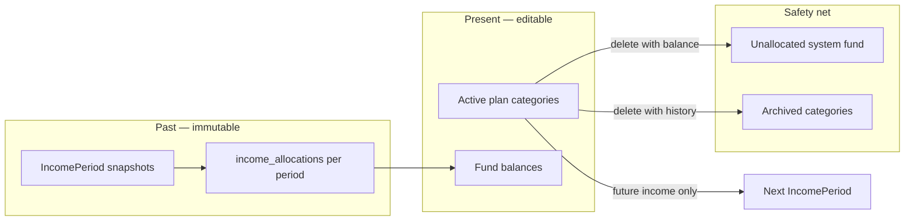
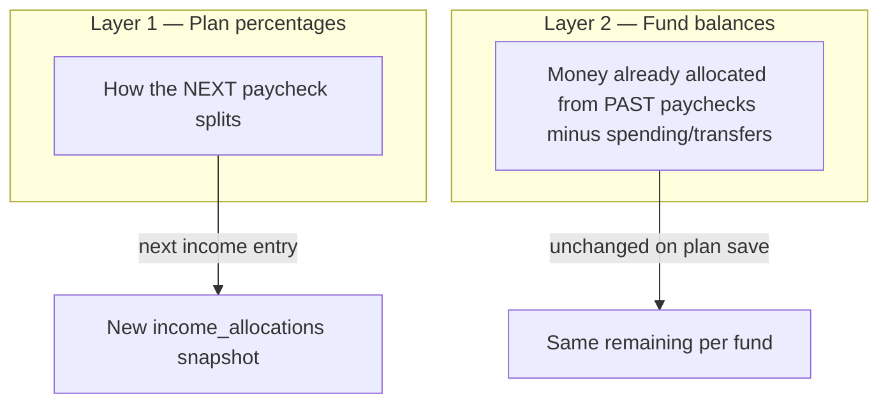
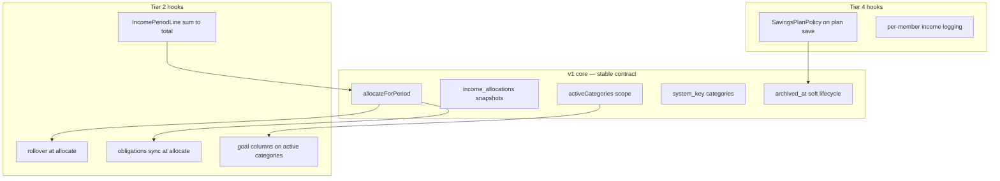

# Flexible envelope model — remove lock, add Unallocated

Parent: [20260801-2112-tier-2-envelope-model-plan.md](./20260801-2112-tier-2-envelope-model-plan.md)

## Problem today

Kinsenas has **two friction layers** that fight versatility:

| Layer | Current behavior | User pain |
|-------|------------------|-----------|
| **Income lock** | Add income → preview → manual Lock → funds spendable | Extra step; unlock already removed from UI but backend remains |
| **Percentage lock** | First income freezes names, %, add/remove of percentage funds | Can't adapt plan as life changes |

Deleting a fund category **cascade-deletes** spends, transfers, and allocations ([`database/migrations/2026_07_31_172111_create_savings_and_vault_tables.php`](../../database/migrations/2026_07_31_172111_create_savings_and_vault_tables.php)) — money can vanish silently.

There is **no Unallocated bucket** anywhere in the codebase.

## Target model (principles)



1. **Past is frozen, future is flexible** — each income period keeps its own `income_allocations` snapshot. Plan edits never rewrite old periods.
2. **Income = spendable immediately** — creating (or finishing) an income entry writes allocations in the same transaction; no Lock button.
3. **Archive, don't destroy** — categories with any financial activity are archived, not hard-deleted.
4. **Unallocated catches orphans** — auto-sweep remaining balance when a fund is removed; hidden unless balance > 0.

---

## Long-term UX decisions (locked)

These choices prioritize **predictable history** and **plain language** over maximum flexibility in v1.

| Decision | Choice | Why (user clarity) |
|----------|--------|---------------------|
| **Historical fund labels** | Snapshot `category_name` (+ `percentage_snapshot` for percentage rows) on each `income_allocation` at allocate/recalculate time | Renaming a fund in the plan must **not** rewrite past paycheck breakdowns. Users trust what they saw when they entered income. |
| **Income show page** | Always display snapshotted name and % from allocation rows | Single source of truth for “what happened this payday.” |
| **Income index grid** | Column set = **union** of all category IDs that appear in any period’s allocations; use snapshot label per cell; muted **(archived)** header when category is archived | Amounts never vanish when a fund is removed; columns may grow over time but history stays visible. |
| **Plan rename** | Updates active plan + future income only; past income keeps snapshot names | Impact preview: “Your plan name changes now. Past income still shows [Old Name].” |
| **Current balances vs plan %** | Future income only; no auto-rebalance in v1 | Avoids surprise money moves. Manual **Transfers** when user wants to reshuffle. |
| **Custom deductions after add income** | Auto-allocate on create → **redirect to income show** when plan has custom categories, with banner to review amounts; save recalculates allocations | One clear place to adjust per-paycheck deductions; no cramming the add modal. |
| **Spending / transfer pickers** | **Active funds only** + Unallocated when balance > 0 | Cannot spend from archived funds; Unallocated is explicitly temporary. |
| **Reports fund health** | Main grid: active + Unallocated; **Archived funds** in collapsed section (zero remaining hidden) | Reports stay scannable; history still available. |
| **User-facing words** | Drop “lock / preview / locked income” → **“income”**, **“fund”**, **“Unallocated”** | Align copy with what actually happens (income → funds are ready). |

### Allocation snapshot schema (v1)

Add to `income_allocations` (same migration pass as auto-allocate):

```php
$table->string('category_name');
$table->decimal('percentage_snapshot', 5, 2)->nullable(); // null for custom/deduction rows
$table->string('allocation_type_snapshot'); // percentage | deduction — frozen at allocate time
```

- Set in **`allocateForPeriod()`** from category at calculation time.
- **Backfill migration:** join existing rows to `savings_categories` for name; percentage from category or null.
- [`breakdownForPeriod()`](../../app/Services/Savings/IncomeCalculationService.php): prefer snapshot fields over live `$allocation->category->name`.

### Terminology map (UI copy)

| Old | New |
|-----|-----|
| Lock income | *(remove — income is ready when saved)* |
| Preview / Locked badge on income | *(remove)* |
| hasLockedIncome | hasIncome (internal prop) |
| “Lock at least one income period…” | “Add income to start recording spending.” |
| Locked periods | Past income / This paycheck (contextual) |

---

## Phase 1 — Auto-allocate income (remove lock ceremony)

### Backend

- **[`IncomeCalculationService::create()`](../../app/Services/Savings/IncomeCalculationService.php)** — after creating `IncomePeriod`, call **`allocateForPeriod()`** (writes `income_allocations` with snapshot fields, sets `allocated_at`, legacy `is_locked = true`).
- **`allocateForPeriod()`** — single entry point for all allocation writes (create, recalculate, migration backfill). Tier 2 rollover/obligations hook here later.
- **`recalculateAllocationsForPeriod(?string $newAmount = null)`** — replace allocation rows when custom amounts or (future) period amount changes; refresh snapshots; call `assertCanRecalculatePeriod()` first.
- **Remove** `lock()` / `unlock()` routes from [`routes/savings.php`](../../routes/savings.php) and controller actions in [`IncomePeriodController`](../../app/Http/Controllers/Savings/IncomePeriodController.php).
- **Repurpose guard** — move [`assertCanUnlockPeriod()`](../../app/Services/Savings/FundBalanceService.php) logic into `assertCanRecalculatePeriod()`.
- **Data migration** — allocate any existing `is_locked = false` periods; backfill snapshot columns on all allocation rows.

### Frontend

- Remove Lock button, Preview badge, and "Preview only" copy from [`income/show.tsx`](../../resources/js/pages/savings/income/show.tsx) and [`income/index.tsx`](../../resources/js/pages/savings/income/index.tsx).
- Update [`add-income-modal.tsx`](../../resources/js/components/savings/add-income-modal.tsx) description: income is allocated immediately; custom amounts can be adjusted on the next screen.
- **After create:** if plan has custom (deduction) categories, redirect to income show with flash: “Review custom amounts for this paycheck if needed.”
- **Income index:** build columns from union of allocated category IDs across periods; header label from latest snapshot or current active name; archived → muted + “(archived)”.
- Replace empty-state copy on spending/transfers/reports/dashboard → **“Add income to start recording spending.”**
- Rename prop **`hasLockedIncome` → `hasIncome`** across controllers, types, and pages.

### Keep `is_locked` column (for now)

Always `true` for new records. Avoid a wide migration in v1; deprecate column later. [`FundBalanceService::allocatedTotalsByCategory()`](../../app/Services/Savings/FundBalanceService.php) can eventually query allocations directly instead of filtering `is_locked`.

---

## Phase 2 — Flexible plan editing + impact preview

### Remove percentage lock

- Delete `percentagesLocked` prop from [`SavingsPlanController`](../../app/Http/Controllers/Savings/SavingsPlanController.php) and [`plan.tsx`](../../resources/js/pages/savings/plan.tsx).
- Replace [`mergeCategoriesAfterIncome()`](../../app/Services/Savings/SavingsPlanService.php) with **`applyPlanChanges()`** that allows add/edit/remove/rename of percentage categories anytime (still validate 100% total for active percentage rows).
- Update [`plan-guidance-panels.tsx`](../../resources/js/components/savings/plan-guidance-panels.tsx) rules table — percentage rows become editable after income.

### Impact preview (before save)

New **`PlanChangePreviewService`** returns a structured diff:

| Change type | User-facing message |
|-------------|---------------------|
| Percentage tweak | "Future income will split differently. Past income periods stay unchanged." |
| New fund | "Starts at ₱0 until your next income entry." |
| Remove fund (zero balance) | "Fund removed. No balance to move." |
| Remove fund (has balance) | "₱X will move to Unallocated. Past spending stays linked to [Old Name]." |
| Rename fund | "Plan and future income use the new name. Past income still shows [Old Name]." |

- Show confirmation dialog on [`plan.tsx`](../../resources/js/pages/savings/plan.tsx) when `plan.hasIncome && diff.hasMaterialChanges` (extend existing custom-category confirm pattern).
- Backend accepts optional `confirm_plan_changes: true` flag to prevent accidental destructive saves via API.

### Custom category rule change

Update the alert on plan page: custom category **plan defaults** affect **future income only** — past `income_period_deductions` + stored allocations are not recalculated (fixes today's misleading "affects all locked periods" copy).

### Percentage changes — where does the "difference" go?

**Recommended default: future income only.** Existing fund balances stay put; the user transfers manually if they want to reshuffle. This is the safest versatile default — no surprise money movement.

#### Validation (always)

| Rule | Behavior |
|------|----------|
| Total **> 100%** | Block save — same as today |
| Total **< 100%** | Block save — percentages must total exactly 100% |
| Total **= 100%** | Allow save |

There is no "partial percentage" state. Lowering one category requires raising another (or adding a new fund) in the same save.

#### Two layers — do not conflate them



**Layer 1 — future income split (changes immediately on plan save)**

When someone lowers Everyday from 50% to 40% and raises Emergency from 10% to 20%:

- The **10% freed** does **not** go to Unallocated.
- It flows to whichever categories **gained** percentage — Emergency (+10% in this example).
- On the **next income entry** (e.g. ₱50,000), Everyday gets ₱20,000 (was ₱25,000 at 50%), Emergency gets ₱10,000 (was ₱5,000 at 10%).
- **Past income periods** keep their original `income_allocations` rows — history is frozen.

**Layer 2 — current fund balances (unchanged on plan save by default)**

- Everyday may still show ₱18,000 remaining from past paychecks — that balance **does not shrink** just because the percentage dropped.
- Percentage is a **forward-looking weight**, not a retroactive clawback of existing money.
- User can **Transfers → move money** between funds anytime if they want balances to match their new priorities.

#### When Unallocated IS used (different scenario)

Unallocated is **only** for **removed** categories that still had a remaining balance — not for percentage redistribution within a 100% plan.

| Action | Where money goes |
|--------|------------------|
| Lower Everyday 50% → 40%, raise Emergency 10% → 20% | Next paycheck split; existing balances unchanged |
| Delete Travel fund with ₱3,000 remaining | Auto-sweep ₱3,000 → **Unallocated** |
| Add new Travel fund at 10%, lower others to fit 100% | Travel starts at ₱0 until next income |

#### Impact preview copy (percentage tweak example)

```
Everyday Fund: 50% → 40%
  • Current balance: ₱18,000 (unchanged)
  • Next income: smaller share

Emergency Fund: 10% → 20%
  • Current balance: ₱2,500 (unchanged)
  • Next income: larger share

Past income periods are not recalculated.
```

#### Optional enhancement (Phase 2b — not v1)

Add an **opt-in checkbox** on the plan-save confirmation dialog:

> **Rebalance my current balances to match new percentages**

When checked, `PlanRebalanceService` computes target shares of **total remaining across active funds** and creates confirmed [`FundTransfer`](../../app/Models/FundTransfer.php) rows to move money between funds. Off by default — avoids surprising users who only wanted to change their next paycheck split.

Skip auto-rebalance-always — it moves money without explicit consent and breaks the envelope mental model.

---

## Phase 3 — Unallocated system fund + archive semantics

### Schema

Add to `savings_categories` (new migration):

```php
$table->string('system_key')->nullable(); // 'unallocated'
$table->timestamp('archived_at')->nullable();
$table->unique(['plan_id', 'system_key']);
```

- **`system_key = 'unallocated'`** — one per plan, auto-created on first orphan sweep.
- **`archived_at`** — set when category removed from active plan but has history.

### Category lifecycle on plan save

New **`CategoryLifecycleService`**:

1. **Remove from plan UI** → if category has zero remaining balance AND no confirmed spends/transfers/allocations → hard delete (same as greenfield).
2. **Remove with remaining balance** → create confirmed [`FundTransfer`](../../app/Models/FundTransfer.php) (`source: plan_sweep`) from removed category → Unallocated; then archive source category.
3. **Remove with history but zero balance** → archive only (keep FK integrity for past records).

### Unallocated UX

- Excluded from percentage 100% validation and plan editor rows (system-managed).
- Shown in [`FundBalanceGrid`](../../resources/js/components/savings/fund-balance-grid.tsx) and spending/transfer pickers **only when `remaining > 0`**.
- Hint text: "Funds from removed categories — transfer to another fund when ready."
- Cannot be deleted or renamed by user; no percentage field.

### FK safety (follow-up migration)

Change `fund_spends.category_id`, `fund_transfers.from/to_category_id`, and `income_allocations.category_id` from **`cascadeOnDelete` → `restrictOnDelete`** so archived categories cannot be accidentally wiped by a bad delete path.

---

## What stays the same

- **Vault unlock** — unrelated encryption gate; no change.
- **Envelope math** — [`FundBalanceService`](../../app/Services/Savings/FundBalanceService.php) formula (allocated − transferred − spent + received) unchanged.
- **Per-period custom deductions** — still stored in `income_period_deductions`; editable on income show with recalculate guard.
- **Tier 2 roadmap** — rollover, goals, obligations still attach to [`SavingsCategory`](../../app/Models/SavingsCategory.php); Unallocated is a system row, not a parallel expense system.

---

## Files touched (grouped)

| Area | Primary files |
|------|----------------|
| Income auto-allocate | `IncomeCalculationService`, `IncomePeriodController`, `add-income-modal.tsx`, income pages |
| Remove lock routes | `routes/savings.php`, tests in `IncomePeriodTest`, `FundSpendTest` |
| Flexible plan | `SavingsPlanService`, `SaveSavingsPlanRequest`, `plan.tsx`, `plan-guidance-panels.tsx` |
| Unallocated + archive | new migration, `CategoryLifecycleService`, `FundBalanceService`, `fund-balance-grid.tsx` |
| Naming cleanup | `SavingsPlan`, controllers, `dashboard.tsx`, `types/savings.ts`, `types/dashboard.ts` |
| Tests | `SavingsPlanTest`, `IncomePeriodTest`, `FundBalanceServiceTest`, `DashboardTest` |

---

## Implementation order

1. **FK restrict + Unallocated + archive + sweep** + `FundTransfer.source` (safety net first)
2. **Allocation snapshots** + `allocated_at` + **`allocateForPeriod()`** refactor
3. Auto-allocate on create + `recalculateAllocationsForPeriod()` + migrate unlocked periods + income UI
4. Rename `hasLockedIncome` → `hasIncome`; `activeCategories()` / `scopeSystem()`; terminology pass
5. Remove percentage lock + impact preview + dependent-custom validation + policy guard on plan save
6. Harden tests + future-proofing checklist (below)

---

## Suggested tests (manual)

```bash
php artisan migrate
php artisan test --compact tests/Feature/Savings/IncomePeriodTest.php
php artisan test --compact tests/Feature/Savings/SavingsPlanTest.php
php artisan test --compact tests/Feature/Savings/FundBalanceServiceTest.php
php artisan test --compact tests/Feature/Savings/FundSpendTest.php
vendor/bin/pint --dirty
npm run build
```

**Visual QA:** Add income from dashboard → immediately record spending. Edit plan percentages → confirm preview → save → add second income → verify new split. Remove a fund with balance → Unallocated row appears → transfer out.

---

## Out of scope

- Recalculating past income when plan changes (explicitly rejected — past stays frozen)
- Auto-rebalancing existing balances on every percentage save (optional Phase 2b only)
- Using Unallocated as a sink for percentage redistribution (Unallocated = deleted categories only)
- Income period delete / undo
- Removing `is_locked` column entirely (defer to cleanup pass)
- Tier 2 rollover rules (separate plan)

---

## Risks, loopholes, and mitigations

Review against the current codebase ([`CategoryAllocationCalculator`](../../app/Services/Savings/CategoryAllocationCalculator.php), [`FundBalanceService`](../../app/Services/Savings/FundBalanceService.php), [`IncomePeriodController`](../../app/Http/Controllers/Savings/IncomePeriodController.php)). Items marked **Critical** should be in scope for v1 — not deferred.

### Critical — data integrity

| Risk | Why it breaks | Mitigation (add to plan) |
|------|----------------|---------------------------|
| **FK cascade still active until Phase 5** | Hard-deleting a category today cascade-deletes spends, transfers, and allocations ([`fund_spends`](../../database/migrations/2026_07_31_183847_create_fund_spends_table_and_migrate_transfers.php), [`income_allocations`](../../database/migrations/2026_07_31_172111_create_savings_and_vault_tables.php)). Phase 2 allows deletes before Unallocated exists. | **Reorder:** FK `restrictOnDelete` + archive-first **before** opening percentage deletes. Never hard-delete a category with any allocations, spends, or transfers. |
| **Archived categories excluded from balance grid** | `balancesForPlan()` iterates `plan->categories` only. Allocations/spends keyed by archived `category_id` would become **invisible** in the grid while still affecting totals. | Add `activeCategories()` scope for editor/pickers; balance/report queries use **active + archived-with-activity + Unallocated**. |
| **Income index table drops history** | Index builds columns from current plan only. | **Union columns** from all allocation category IDs; snapshotted labels; archived muted (see Long-term UX decisions). |
| **Rename rewrites history** | Live join on `category->name`. | **Snapshot `category_name` + `percentage_snapshot` on `income_allocations` at allocate time (v1).** |
| **Custom amounts after auto-allocate** | `syncCustomAmounts` does not recalculate allocations. | **`recalculateAllocationsForPeriod()`** after custom-amount save; redirect to show when plan has custom categories. |
| **Remove fund that custom categories depend on** | `deduct_from_category_id` uses `nullOnDelete`. Removing a percentage source orphans or breaks custom deductions ([`CategoryAllocationCalculator`](../../app/Services/Savings/CategoryAllocationCalculator.php) line 51). | Block archive/delete of a percentage fund while any active custom category deducts from it; force reassign or remove dependents first. |

### Critical — implementation order

| Risk | Mitigation |
|------|------------|
| Phase 2 (flexible delete) ships before Phase 3 (Unallocated) | Ship **Unallocated + archive + sweep** in the same release as flexible deletes — or keep delete blocked until sweep exists. |
| `confirm_plan_changes` only in UI | Server must **always** enforce lifecycle rules; flag is UX only, not authorization. |

### Medium — behavioral edge cases

| Risk | Notes |
|------|--------|
| **Sweep while vault locked** | System transfer to Unallocated requires decrypted amounts. Block plan save with destructive changes if vault locked, or queue sweep after unlock. |
| **Negative remaining before delete** | If overspent, `remaining` can be negative. Sweep should use `max(remaining, 0)`; user still owes the envelope math — surface warning. |
| **Everyday Fund removed** | [`defaultCategoryId()`](../../app/Services/Savings/FundBalanceService.php) falls back to first by sort order — OK, but tests and UX assume Everyday. Document fallback. |
| **Unallocated in calculator** | [`calculate()`](../../app/Services/Savings/CategoryAllocationCalculator.php) loops all categories. System row must be excluded or it gets `0.00` and may break 100% validation if mis-typed. | Exclude `system_key IS NOT NULL` from percentage totals and allocation loop. |
| **Spending from Unallocated / archived** | Pickers must filter to **active** categories only (+ Unallocated when balance > 0). Archived funds: view-only in reports. |
| **Concurrent edit + spend** | User A edits plan while User B spends from a fund being archived. | DB transaction on plan save; re-check remaining before sweep transfer (same pattern as spend assert). |
| **No income amount edit endpoint** | Wrong amount entered → allocations wrong until delete/recreate (out of scope). | v1: note in QA. Consider `PUT income/{period}` with recalculate guard. |

### Low — UX / reporting (not silent data loss)

| Risk | Notes |
|------|--------|
| **Plan % vs balance mismatch** | By design (future-only split). Mitigate with impact preview copy already in plan. |
| **Reports fund_health includes archived** | May clutter reports. Filter active + Unallocated; optional “Archived funds” section. |
| **`is_locked` always true** | Code paths filtering `is_locked` still work but name is misleading. Track deprecation. |
| **Tier 2 rollover** | Rollover at “lock time” becomes “allocate time” — update Tier 2 plan wording when implemented. |

### Recommended plan amendments

1. **Merge Phase 3 ahead of flexible deletes** — Unallocated + archive + FK restrict before opening percentage deletes.
2. **Allocation snapshots in v1** — not deferred; backfill existing rows.
3. **`recalculateAllocationsForPeriod()`** in Phase 1 with post-create redirect for custom-category plans.
4. **`activeCategories()` scope** for editor/pickers; balance queries include archived-with-activity + Unallocated.
5. **Block dependent custom category orphans** on fund removal.
6. **Test cases:** snapshot survives rename; union index columns; delete fund with balance → Unallocated; custom amount edit → allocations + snapshots update.

---

## Future-proofing audit

Cross-checked against [Tier 2 envelope extensions](./20260801-2112-tier-2-envelope-model-plan.md) (rollover, goals, obligations, multi-income), [Tier 4 team/family](./20260801-2112-tier-4-team-family-plan.md) (shared plans, permissions), and current models ([`SavingsCategory`](../../app/Models/SavingsCategory.php), [`FundTransfer`](../../app/Models/FundTransfer.php), [`IncomeAllocation`](../../app/Models/IncomeAllocation.php)).

### Verdict

**Mostly future-proof.** The archive + snapshot + Unallocated model is the right long-term foundation for envelope extensions. A few **small v1 additions** below prevent rework when Tier 2–4 land. Nothing in the plan blocks the roadmap if those additions ship with v1.



### Solid for the long term

| Area | Why it holds up |
|------|------------------|
| **Per-period allocation snapshots** | Tier 2 multi-income still produces one allocation set per period from a total; snapshots stay correct. |
| **`archived_at` + FK restrict** | Tier 2 goals/debt metadata on `SavingsCategory` survives on archived rows; reports can still read history. |
| **`system_key` on categories** | Extensible beyond `unallocated` (e.g. future system rows) via unique `(plan_id, system_key)`. |
| **Future-only plan %** | Tier 2 rollover runs at **allocate time**, not by rewriting past periods — aligns with frozen history. |
| **Unallocated as orphan sink** | Does not compete with Tier 2 obligations or expense tags; stays fund-centric. |
| **Envelope math unchanged** | Goals, debt, spend tags layer on top of `remaining` — no parallel ledger. |

### Gaps to close in v1 (avoid rework)

| Gap | Risk if skipped | v1 addition |
|-----|-----------------|-------------|
| **No single allocate entry point** | Tier 2 rollover/obligations bolt onto `create()` and `lock()` separately → duplicate bugs | Refactor to **`IncomeCalculationService::allocateForPeriod(IncomePeriod, User)`** — only path that writes allocations + snapshots; `create()` calls it; `recalculateAllocationsForPeriod()` calls it. |
| **Sweep transfers indistinguishable** | Reports/audit cannot filter system moves vs user transfers | Add **`FundTransfer.source`** enum: `user`, `plan_sweep`, (reserve `rollover`, `rebalance` for Tier 2 / Phase 2b). Set `plan_sweep` on Unallocated sweeps. |
| **Custom category history incomplete** | Renaming/removing custom deduction rules makes old income rows ambiguous | Add **`allocation_type_snapshot`** on `income_allocations` (`percentage` \| `deduction`); backfill from category. |
| **System rows editable via API** | Plan save could drop or overwrite Unallocated | **`applyPlanChanges()`** ignores system categories in payload; never archives Unallocated; calculator excludes `system_key IS NOT NULL`. |
| **`is_locked` semantic debt** | Tier 2 docs still say “lock”; queries multiply | Add **`allocated_at`** on `income_periods` (set when allocations written); treat as source of truth for “has allocations”; deprecate `is_locked` in code comments. |
| **Recalculate signature too narrow** | Tier 2 income-line edits need amount recalc | Design **`recalculateAllocationsForPeriod()`** to accept optional new period amount (even if v1 only uses custom deductions). |

### Tier 2 compatibility notes (update sibling plan when implementing)

| Tier 2 feature | How this plan accommodates it |
|----------------|-------------------------------|
| **Fund rollover** | Hook **before** `allocateForPeriod()` computes amounts: read prior `remaining` per category, apply `rollover_mode`, optionally create `source: rollover` transfers. Replace “lock time” with **allocate time** in Tier 2 plan wording. |
| **Recurring obligations** | On allocate, `RecurringObligationService` pre-fills `income_period_deductions` then allocate runs — same as custom amounts today. Block archiving a fund with **active** obligations pointing at it. |
| **Savings goals / debt columns** | Live on **active** `SavingsCategory` only; archived funds show historical goal/debt in collapsed report section, not plan editor. |
| **Multi-source income lines** | `IncomePeriodLine` rows sum to period total → **`allocateForPeriod()`** unchanged; snapshots still per allocation row. |
| **Spend tags** | Unaffected — tags on `FundSpend`, not categories. |

### Tier 4 compatibility notes

| Concern | Mitigation |
|---------|------------|
| **Shared plan edit by member** | Archive/sweep/plan save must go through **`SavingsPlanPolicy::update`** — read-only members cannot trigger lifecycle or Unallocated sweeps. |
| **Per-member income logging** | `allocateForPeriod()` already per period; add `logged_by_user_id` on `IncomePeriod` later without changing allocation model. |
| **Concurrent family edits** | Plan save transaction + re-check remaining before sweep (already in Risks). Consider optimistic lock on plan `updated_at` in Tier 4 if conflicts appear. |

### Known limits (acceptable; document, don’t “fix” in v1)

| Limit | Impact | Mitigation later |
|-------|--------|------------------|
| **Income index union columns grow** | Many archived funds → wide table on desktop/mobile | Horizontal scroll already used; later: “hide empty archived columns” toggle or cap visible columns with expand. |
| **No income period delete** | Wrong paycheck requires support/engineering | Tier 2+: `DELETE` with recalculate guard or void flag — out of scope now. |
| **Spending history uses live category name** | Archived fund rename changes label on old spends (not amounts) | v1.1: optional `category_name` snapshot on `FundSpend` if users report confusion — lower priority than income snapshots. |
| **Phase 2b rebalance deferred** | Power users rebalance manually | Optional checkbox later; `FundTransfer.source = rebalance` reserved. |
| **100% percentage cap** | Cannot model “income overflow” bucket by design | Unallocated is for **removed** funds only — intentional envelope constraint. |

### Future-proofing checklist (add to v1 done criteria)

- [ ] All allocation writes go through `allocateForPeriod()` only
- [ ] Snapshots: `category_name`, `percentage_snapshot`, `allocation_type_snapshot`
- [ ] `FundTransfer.source` on sweep rows
- [ ] `income_periods.allocated_at` populated; fund gating uses “has allocations” not “is_locked” in new code
- [ ] `SavingsCategory::scopeActive()` / `scopeSystem()` / calculator excludes system rows
- [ ] Plan save cannot mutate `system_key = unallocated`
- [ ] Tier 2 plan updated: “lock time” → “allocate time” for rollover/obligations

