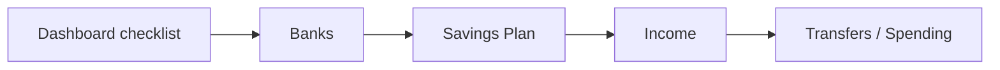

# Driver.js onboarding tour

Related: banks-first copy/nav shipped in the same session (Banks page tip, sidebar order, soft plan gate, dashboard setup step order).

## Problem

New users land on Dashboard / Savings Plan without knowing that **banks are references** and should be added **before** assigning funds on a plan. Static copy helps; a short spotlight tour makes the path obvious once.

## Recommendation

**Library:** [Driver.js](https://driverjs.com/) (MIT, ~5KB, framework-agnostic)

| Why Driver.js | Why not |
|---------------|---------|
| Tiny, polished overlay | Not React-native — wrap in a hook |
| MIT-friendly for SaaS | Multi-page SPA tours need careful step `onNextClick` / route visits |
| Easy to theme to match Kinsenas | Complex conditional branches better in react-joyride |

**Do not use** Intro.js / Shepherd open-source AGPL without a commercial license.

## Target flow (tour steps)



| Step | Target (`data-tour`) | Copy (draft) |
|------|----------------------|--------------|
| 1 | `nav-banks` (sidebar Banks item) | Start here — add every bank account you use. |
| 2 | `banks-intro` or `add-bank` | These are references only. Kinsenas does not move money; you still transfer in your banking apps. |
| 3 | `nav-plan` | After banks are listed, pick a savings formula. |
| 4 | `banks-first` or `plan-templates` | Assign each fund to a bank so you know where money should live. |
| 5 | `nav-income` (optional) | Enter income next so allocations appear. |
| 6 | Dashboard “All set” / dismiss | You’re ready — use Transfers when you move money between accounts. |

Keep the tour to **4–6 steps**. Skip steps whose targets are missing (e.g. already has banks → skip empty-state emphasis).

## Data model

**v1 (ship fast):** `localStorage` key `kinsenas.onboardingTour.v1.{teamId}` = `{ completedAt }`.

**v2 (recommended soon):** column on `teams` or `team_user` preference, e.g. `onboarding_tour_completed_at`, so completion follows the user across devices. Expose via Inertia shared props.

## Backend

| Area | Change |
|------|--------|
| Database | Optional v2 migration for completion timestamp |
| Models | Team / membership preference accessor |
| Shared Inertia props | `onboarding: { tourCompleted: bool, shouldAutoStart: bool }` |
| Seeders / factories | N/A for v1; factory state `tourCompleted` for v2 tests |
| Permissions | Any member with savings access can complete/restart tour |

## Frontend

| File (proposed) | Role |
|-----------------|------|
| `resources/js/lib/onboarding-tour.ts` | Step definitions, Driver.js config, theme tokens |
| `resources/js/hooks/use-onboarding-tour.ts` | Start / destroy / mark complete; Inertia visit between pages if needed |
| `resources/js/components/onboarding/restart-tour-button.tsx` | Settings or Dashboard “Replay tour” |
| Sidebar / Banks / Plan / Dashboard | `data-tour="…"` anchors (some already added: `add-bank`, `banks-intro`, `banks-first`, `plan-templates`) |

**Multi-page behavior:** either (a) one page-local tour per route, or (b) Driver.js steps that call `router.visit` then continue — prefer (a) for v1 (Dashboard intro → Banks page tour → Plan page tip) to avoid fragile SPA orchestration.

## Theme

Match shadcn/Kinsenas:

- Popover: `bg-background`, `border`, `text-foreground`
- Primary button uses existing primary color
- Avoid purple default Driver theme; override with CSS variables in `resources/css/app.css`

## Tests

| File | Coverage |
|------|----------|
| `tests/Feature/DashboardTest.php` | Already asserts banks-first setup step order |
| `tests/Feature/Savings/SavingsPlanTest.php` | Soft gate props (`teamBanks`) |
| New (v2) | Completing tour sets preference |
| Browser (optional) | Smoke: open Banks empty state shows intro alert |

Suggested commands (do not run unless asked):

```bash
php artisan test --compact tests/Feature/DashboardTest.php
php artisan test --compact tests/Feature/Savings/SavingsPlanTest.php
```

## Out of scope

- Hard-blocking plan creation without banks (soft gate only)
- Hosted SaaS onboarding (Appcues / Userflow)
- Video walkthroughs inside tour steps (keep pageGuidance videos separate)
- Mobile app / PWA install tour

## Implementation order

1. Install `driver.js` + CSS
2. Add remaining `data-tour` on sidebar nav items
3. Page-local tours: Banks (empty), Plan chooser (no banks / has banks)
4. Dashboard “Continue setup” already points at first incomplete step (banks) — optional highlight on checklist
5. Persist completion + Restart control
6. Tests + Visual QA

## Fresh-seed regression checklist

1. `migrate:fresh --seed` → log in as demo user
2. Dashboard **Get started** step 1 = **Add your banks**
3. Sidebar order: Dashboard → Banks → Savings Plan → …
4. Banks empty state + info alert visible
5. Plan chooser without banks shows **Add your banks first** warning; **Use this formula** still works
6. After adding a bank, warning disappears; plan assign dropdowns populate
