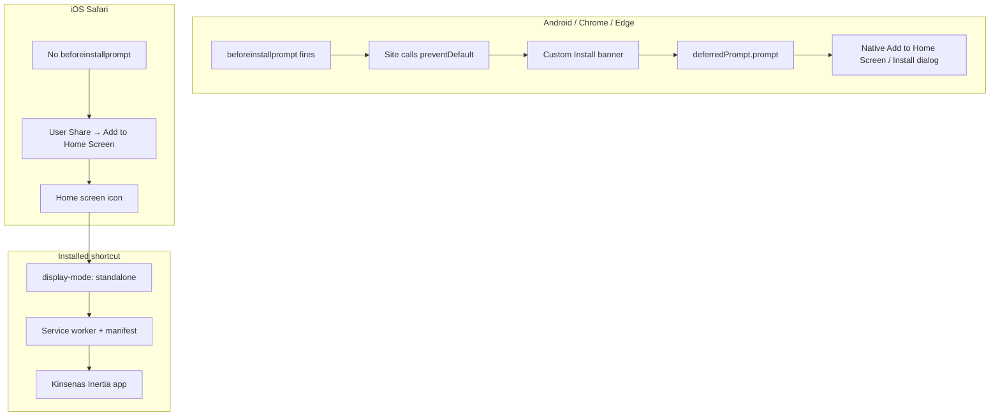
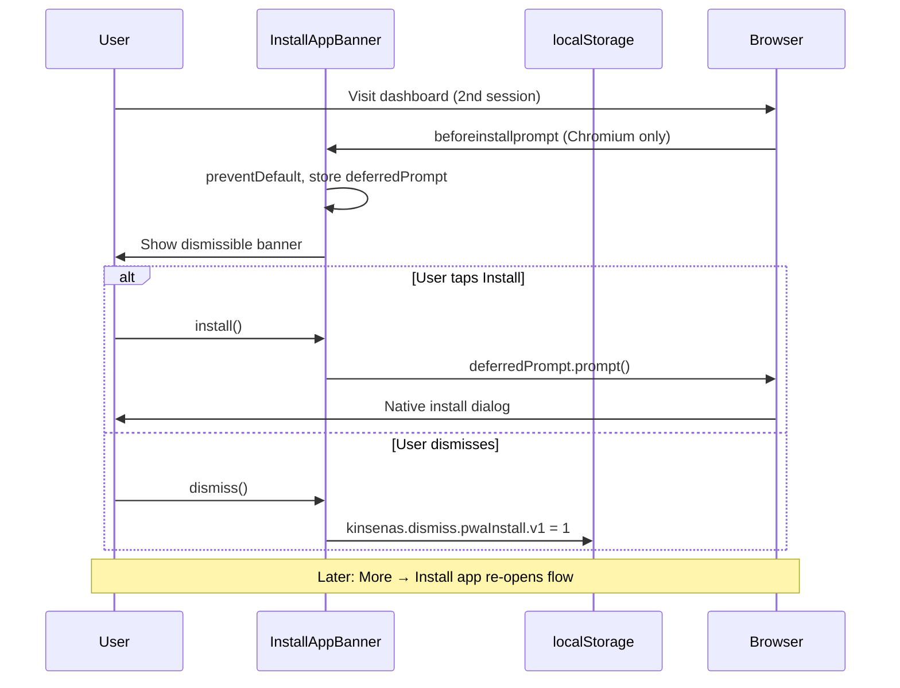

# PWA install UX plan

**Parent:** [20260801-2115-pwa-mobile-exploration-plan.md](./20260801-2115-pwa-mobile-exploration-plan.md) (Phase B–C foundation)

**Related breakdowns:** [20260804-0306-pwa-shared-ui-breakdown.md](../breakdowns/20260804-0306-pwa-shared-ui-breakdown.md), [20260804-0400-mobile-layout-pass-breakdown.md](../breakdowns/20260804-0400-mobile-layout-pass-breakdown.md)

---

## Current state (already shipped)

| Piece | Status | Location |
|-------|--------|----------|
| Web manifest + service worker | ✅ | [`vite.config.ts`](../../vite.config.ts), `registerType: 'prompt'` |
| SW update toast | ✅ | [`resources/js/app.tsx`](../../resources/js/app.tsx) (production only) |
| Push handler in SW | ✅ | [`public/sw-push.js`](../../public/sw-push.js) |
| Blade PWA meta | ✅ | [`resources/views/app.blade.php`](../../resources/views/app.blade.php) |
| Icon pipeline | ✅ | [`scripts/generate-pwa-icons.php`](../../scripts/generate-pwa-icons.php), `npm run icons:pwa` |
| Install banner (Chromium + iOS hint) | ✅ Partial | [`packages/ui/src/components/install-app-banner.tsx`](../../packages/ui/src/components/install-app-banner.tsx) |
| Banner placement | ✅ | [`resources/js/layouts/app/app-sidebar-layout.tsx`](../../resources/js/layouts/app/app-sidebar-layout.tsx) — top of every authed page |
| Mobile polish + bottom nav | ✅ | Mobile layout pass breakdown |
| Dismiss (localStorage) | ✅ | Key `kinsenas-pwa-install-dismissed` |

**Gap:** Foundation is installable; **discovery, timing, styling, entry URL, and QA** are not production-ready for beta users.

---

## Problem / target model

### How install works (by platform)



| Platform | Site can trigger install? | What we show |
|----------|---------------------------|--------------|
| Android Chrome | Yes — `beforeinstallprompt` | **Install app** button → native dialog |
| Desktop Chrome/Edge | Yes | Same |
| iOS Safari | No | **Instructions** only (Share → Add to Home Screen) |
| Already installed | N/A | Hide all install UI (`display-mode: standalone`) |

### Target UX for Kinsenas

1. **Eligible users** see a dismissible install prompt at the right moment — not on first login before they understand value.
2. **iOS users** get clear, on-brand steps (not a dead-end banner without a button).
3. **Dismissed users** can still install later from **More** or **Settings**.
4. **Installed shortcut** opens the app at a sensible entry (dashboard when logged in, not marketing welcome).
5. **Visual consistency** — banner matches Tailwind/shadcn shell (today it uses Tamagui in `@kinsenas/ui`).
6. **Verifiable** — Lighthouse installable + manual checklist before beta comms.

---

## Phase 1 — Prompt timing and discovery (ship first)

### 1.1 Install eligibility hook

Create `usePwaInstall()` (or extend install banner logic) with gates:

| Gate | Rule |
|------|------|
| Already standalone | Never show |
| Dismissed | Hide banner; allow re-open from More/Settings |
| Auth / layout | Only member app shell (`app-sidebar-layout`), not auth, welcome, survey, admin |
| Subscription | `subscription.hasAccess` (same as bottom nav) |
| Vault | Optional: hide until vault unlocked (user can use app fully) |
| Engagement | **Recommended:** show after 2nd session or when `setup.hasPlan` is true — avoids nag on day-zero |

Storage keys (align with [`dismissible-banner.ts`](../../resources/js/lib/dismissible-banner.ts) pattern):

- `kinsenas.dismiss.pwaInstall.v1` — permanent dismiss
- Optional: `kinsenas.snooze.pwaInstall.v1` — re-show after 7 days

### 1.2 Restyle install banner

Options (pick one in implementation):

| Option | Pros | Cons |
|--------|------|------|
| **A. Web adapter** — `resources/js/components/pwa/install-app-banner.tsx` wraps ui logic with shadcn Alert | Matches app; minimal package churn | Two files |
| **B. Migrate component to shadcn** in `@kinsenas/ui` | Single source | ui package needs web Alert primitives |

Recommend **Option A** for Kinsenas: keep `beforeinstallprompt` logic in a hook, render with same pattern as [`PublicBetaAlert`](../../resources/js/components/public-beta-alert.tsx) + [`DismissButton`](../../resources/js/components/dismiss-button.tsx).

### 1.3 Persistent install entry points

| Location | Behavior |
|----------|----------|
| **Mobile More sheet** | Row: “Install app” — hidden when standalone; on iOS opens instruction sheet; on Chromium calls stored deferred prompt or explains if unavailable |
| **Settings → Appearance** | Same row for desktop users who dismissed mobile banner |

Reuse one `InstallAppSheet` / `openInstallFlow()` helper.

### 1.4 Banner placement tweak

Current: above header on every page — competes with Open Beta banner.

Recommend:

- **Single slot** below header OR collapsible priority: Install > Open Beta (beta dismiss already exists)
- Do **not** stack two full-width alerts on mobile dashboard

---

## Phase 2 — Manifest and iOS polish

### 2.1 Smart `start_url`

Today manifest uses `start_url: '/'` → [`welcome`](../../routes/web.php) for cold opens.

Add Laravel route:

```
GET /launch → redirect:
  - authed + team → route('dashboard', currentTeam)
  - authed, no team → /settings/teams
  - guest → /login
```

Update manifest: `start_url: '/launch'`, `scope: '/'`.

No DB change; one controller or closure in `web.php`.

### 2.2 Manifest enhancements

In [`vite.config.ts`](../../vite.config.ts):

| Field | Purpose |
|-------|---------|
| `id: '/'` or `id: 'https://kinsenas.com/'` | Stable install identity across manifest updates |
| `categories: ['finance', 'productivity']` | Store-style hints (where supported) |
| `screenshots` (optional) | Richer Chrome install dialog — 540×720 mobile PNG |
| Dark `theme_color` | Match `dark:` shell — may need media query manifest (limited support) or pick neutral brand teal |

Regenerate icons if brand changes: `npm run icons:pwa`.

### 2.3 iOS install mini-guide

Replace one-line hint with 3 steps:

1. Tap **Share** (SF symbol / icon)
2. Tap **Add to Home Screen**
3. Tap **Add**

Optional: bottom sheet triggered from More → Install, with `apple-touch-icon` preview.

Meta tags already in [`app.blade.php`](../../resources/views/app.blade.php) — verify `icon-180.png` exists after `icons:pwa`.

---

## Phase 3 — QA, dev workflow, tests

### 3.1 Manual install test matrix

| Step | Android Chrome | iOS Safari | Desktop Edge |
|------|----------------|------------|--------------|
| Production build (`npm run build`) | Required | Required | Optional |
| HTTPS (or localhost) | Required | Required | Required |
| Lighthouse PWA → Installable | Pass | N/A (no BIP) | Pass |
| Install → open shortcut | Lands on dashboard (after `/launch`) | Standalone, no URL bar | App window |
| Login → spend flow | Works | Works | Works |
| SW update toast after redeploy | Toast + Reload | Same | Same |
| Push notification click | Opens app (existing `sw-push.js`) | iOS limited | N/A |

**Note:** `devOptions.enabled: false` in vite — install testing is **production build only** unless temporarily enabled.

### 3.2 Optional dev ergonomics

- Document in breakdown: Application → Manifest / Service Workers in Chrome DevTools
- Optional: env flag `VITE_PWA_DEV=true` to enable `devOptions.enabled` locally (never in prod)

### 3.3 Tests

| Test | Assertion |
|------|-----------|
| `tests/Feature/PwaManifestTest.php` (new) | `GET /manifest.webmanifest` returns 200, JSON with `name`, `icons`, `display: standalone`, `start_url` |
| `tests/Feature/PwaLaunchTest.php` (new) | `/launch` redirects guest to login; member to team dashboard |
| Existing `DashboardTest` | No regression |

Browser smoke (optional): pest-plugin-browser — open dashboard, assert install meta present.

---

## Architecture: install prompt lifecycle



---

## Impact checklist

| Area | Impact |
|------|--------|
| **Database** | N/A |
| **Models & relationships** | N/A |
| **Seeders & factories** | N/A |
| **Enums & permissions** | Gate on `subscription.hasAccess`, `beta.approved` — same as member nav |
| **Routes & Wayfinder** | New `/launch` route → run `php artisan wayfinder:generate` if typed routes needed |
| **Form requests & validation** | N/A |
| **Services & events** | Optional: log install acceptance client-side only (no PII) |
| **Inertia props & TS types** | Optional shared `pwa: { canInstall: boolean }` — prefer client-only detection |
| **UI components** | `InstallAppBanner` adapter, More sheet row, Settings row, iOS guide sheet |
| **Settings / admin** | Appearance page install row |
| **Print / export / reports** | N/A |
| **Change logs / audit text** | N/A |
| **Tests** | Manifest + launch redirect feature tests |
| **Docs** | N/A unless beta comms doc requested |

---

## Recommended sprint order

1. **Sprint A (1–2 days):** Phase 1 — eligibility, Tailwind banner, More/Settings install entry, banner stacking fix
2. **Sprint B (1 day):** Phase 2 — `/launch`, manifest `id`, iOS guide sheet
3. **Sprint C (0.5 day):** Phase 3 — Lighthouse pass, feature tests, beta QA checklist

---

## Out of scope

- Capacitor / React Native wrapper
- Offline spend queue or offline vault
- Forcing install (must remain user-initiated)
- App Store / Play Store listing
- Web push opt-in UX (separate from install; `sw-push.js` already exists)

---

## Suggested verification (manual)

```bash
npm run icons:pwa
npm run build
# Serve production assets (Herd + built manifest)

# Feature tests
php artisan test --compact tests/Feature/PwaManifestTest.php
php artisan test --compact tests/Feature/PwaLaunchTest.php

vendor/bin/pint --dirty
npm run types:check
```

### Visual QA (manual)

**URL:** http://financial-literacy.test (production build)

1. Log in as beta member on **Android Chrome** (~390px) — install banner appears after eligibility gate; tap **Install app** → native dialog
2. **iOS Safari** — More → Install app → 3-step sheet; complete Add to Home Screen manually
3. Open installed shortcut — lands on **dashboard**, not welcome
4. Dismiss banner → confirm hidden; More → Install still available
5. Redeploy → SW update toast → Reload works

---

## Changelog vs exploration plan

Update [20260801-2115-pwa-mobile-exploration-plan.md](./20260801-2115-pwa-mobile-exploration-plan.md) todos when implementing:

| Exploration todo | Status |
|------------------|--------|
| vite-plugin-pwa, blade meta, icons, sw-update | ✅ Done |
| InstallAppBanner | ⚠️ Partial — this plan completes it |
| mobile layout / bottom nav | ✅ Done (separate pass) |
| Lighthouse QA | 🔲 This plan Phase 3 |
