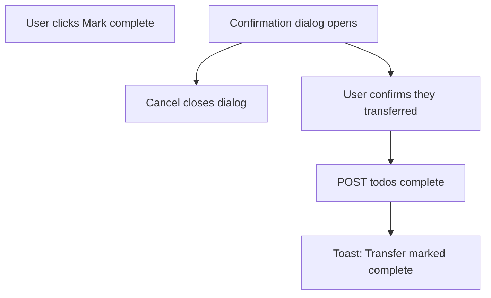

# Confirm before marking income bank transfers complete

## Problem

Today, **Mark complete** on the **Move to your banks** checklist (`income-distribution-todos.tsx`) submits immediately with no friction. These todos are **checklist-only** — they do not create `FundTransfer` rows and Kinsenas has **no bank integration** to verify money moved.

Members may mark items complete without transferring, which makes:

- Remaining fund balances look “healthier” than reality
- Progress badges (“All transfers confirmed”) misleading
- The checklist feel like busywork instead of an honesty checkpoint

There is also **no undo** for completed todos today, so a mistaken click is sticky until income is re-saved with changed allocations (which resets pending state).

## Target UX



### Dialog content (draft copy)

| Element | Copy |
|--------|------|
| **Title** | Confirm bank transfer? |
| **Body** | Kinsenas cannot see your bank activity. Mark this complete only after you have moved **{amount}** to **{bankDisplayName}** ({categoryName}) in your banking app. If you mark complete without transferring, your fund balances and reports will not reflect what you actually have. |
| **Fallback bank** | When no bank assigned: “your assigned bank” + keep link to plan (same as list row) |
| **Cancel** | Cancel |
| **Confirm** | I transferred this — mark complete |

Tone: calm reminder, not accusatory. Mirrors the cross-bank transfer reminder in [`add-transfer-modal.tsx`](resources/js/components/savings/add-transfer-modal.tsx) (“Before confirming… transfer… in your banking app”).

### List section tweaks (same pass)

Update the section description under **Move to your banks**:

- **From:** “Transfer each amount in your banking app, then mark it complete here.”
- **To:** “Transfer each amount in your banking app first. Mark complete only when the money has actually moved — Kinsenas cannot verify your bank.”

Optional: rename button **Mark complete** → **Mark transferred** (only if it reads clearer; default keep **Mark complete** + stronger dialog).

## Implementation

### Frontend only — no backend changes

| File | Change |
|------|--------|
| **New** [`resources/js/components/savings/confirm-income-distribution-todo-modal.tsx`](resources/js/components/savings/confirm-income-distribution-todo-modal.tsx) | Dialog + Inertia `Form` POST to existing complete route; props: `todo`, `periodId`, `teamSlug`, `open`, `onOpenChange` |
| [`resources/js/components/savings/income-distribution-todos.tsx`](resources/js/components/savings/income-distribution-todos.tsx) | Track `confirmTarget: IncomeDistributionTodo \| null`; row button opens modal instead of inline `Form`; render modal when target set |
| [`resources/js/types/savings.ts`](resources/js/types/savings.ts) | No change unless modal needs a narrowed type export |

**Patterns to reuse:**

- Dialog structure from [`delete-income-modal.tsx`](resources/js/components/savings/delete-income-modal.tsx)
- Reminder wording from [`add-transfer-modal.tsx`](resources/js/components/savings/add-transfer-modal.tsx) bank reminder dialog
- `formatMoney(todo.amount)` per [money-formatting.mdc](.cursor/rules/money-formatting.mdc)

**Behavior:**

- Pending todos only — completed rows unchanged
- Confirm button disabled while `processing`
- `onSuccess` closes modal (same as delete modal)
- Mobile: dialog scrolls if needed (`DialogContent` max height)

### Backend — N/A

Existing route and service stay as-is:

- `POST income/{incomePeriod}/todos/{todo}/complete`
- [`IncomeDistributionTodoService::complete()`](app/Services/Savings/IncomeDistributionTodoService.php)

No new form field (e.g. `confirmed=true`) unless we later want server-side audit — **out of scope** for this pass.

## Impact checklist

| Area | Notes |
|------|-------|
| Database | N/A |
| Models / services | N/A |
| Routes / Wayfinder | N/A — same POST |
| Inertia props | N/A |
| UI | Income show only (checklist component) |
| Index page | N/A — index shows progress badge only, no Mark complete |
| Tests | Existing [`IncomeDistributionTodoTest.php`](tests/Feature/Savings/IncomeDistributionTodoTest.php) unchanged; optional future browser smoke |
| Docs | N/A — not requested |
| Permissions | Unchanged — same auth as complete action |

## Tests

**Automated:** No new Feature tests required (behavior is client-side confirmation before the same POST). Existing complete tests remain valid.

**Manual Visual QA** (add to breakdown when implemented):

1. Log in, open **Income** → income period with pending todos
2. Click **Mark complete** on a row → dialog appears with amount, fund name, bank
3. **Cancel** → dialog closes, todo stays pending
4. Click again → **I transferred this — mark complete** → toast, row shows confirmed
5. Todo with no bank → dialog mentions assigning bank / generic wording
6. Mobile ~375px: dialog usable, no console errors

Suggested commands (unchanged):

```bash
php artisan test --compact tests/Feature/Savings/IncomeDistributionTodoTest.php
npm run dev
```

## Out of scope

- **Undo / mark pending again** — separate feature; confirmation reduces need
- **“Mark all complete”** bulk action
- **Server-side attestation** checkbox stored in DB
- **Blocking complete** when no bank assigned (keep current link-to-plan hint only)
- **Pending-actions dashboard** copy changes (optional follow-up if that panel references todos)

## Suggested commit (after implementation)

```
Summary: Confirm before marking income bank transfers complete

Add a reminder dialog before completing distribution todos so members acknowledge Kinsenas cannot verify real bank transfers and balances stay realistic.
```
