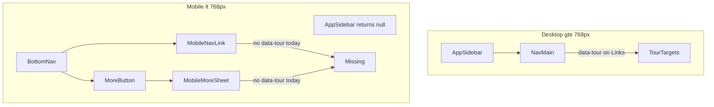
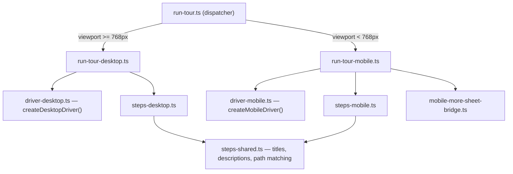

# Fix Driver.js onboarding tour on mobile

Related: [original Driver.js plan](./20260802-0043-driverjs-onboarding-tour-plan.md)

## Constraint (user requirement)

**Desktop must keep working exactly as it does today.** Do not add mobile conditionals into the desktop Driver.js path. Use **separate modules** for each platform and a thin dispatcher at the entry point.

## Root cause

The tour was built for the **desktop sidebar**. Mobile now uses a different nav shell:



| Tour step | Desktop target | Mobile today |
|-----------|----------------|--------------|
| `nav-banks` | Sidebar Banks link | **Missing** (sidebar unmounted; Banks is in More sheet, closed) |
| `nav-plan` | Sidebar Savings Plan | **Missing** (same) |
| `nav-income` | Sidebar Income | **Missing** (Income is in bottom tab bar, no `data-tour`) |
| Page steps (`setup-checklist`, `banks-intro`, `plan-main`, …) | In page content | Still work |

[`run-tour.ts`](resources/js/lib/onboarding-tour/run-tour.ts) uses `skipMissingElement: true`, so missing nav steps are silently skipped on mobile.

## Architecture — separate Driver.js setups



### Proposed file layout

```
resources/js/lib/onboarding-tour/
  steps-shared.ts          # Step ids, titles, descriptions, pathIncludes, navigateTo (page steps)
  steps-desktop.ts         # Desktop step list + sidebar selectors (current ONBOARDING_TOUR_STEPS, unchanged)
  steps-mobile.ts          # Mobile step list + mobile-only metadata (openMoreSheet, popoverSide, fallbackNavigateTo)
  driver-desktop.ts        # Driver.js config factory — extract verbatim from current run-tour.ts
  driver-mobile.ts         # Driver.js config factory — mobile popover sides, waitForElement, overlay tweaks
  run-tour-desktop.ts        # Desktop orchestration (navigateForStep, onNext/onPrev) — no mobile imports
  run-tour-mobile.ts         # Mobile orchestration + More sheet prep + fallback navigation
  run-tour.ts                # Thin public API: isMobileViewport() ? runMobile : runDesktop
  storage.ts                 # Unchanged
```

### Entry point ([`run-tour.ts`](resources/js/lib/onboarding-tour/run-tour.ts))

Keep the same exported API (`runOnboardingTour`, `stopOnboardingTour`, `isOnboardingTourRunning`) so [`onboarding-tour-host.tsx`](resources/js/components/onboarding/onboarding-tour-host.tsx) and [`replay-tour-button.tsx`](resources/js/components/onboarding/replay-tour-button.tsx) need no import changes.

```ts
export function runOnboardingTour(options: RunOnboardingTourOptions): void {
  if (isMobileViewport()) {
    runMobileOnboardingTour(options);
  } else {
    runDesktopOnboardingTour(options);
  }
}
```

Only one driver instance active at a time (shared `activeDriver` ref in dispatcher, or each module registers destroy with dispatcher).

### Desktop path — do not change behavior

**[`run-tour-desktop.ts`](resources/js/lib/onboarding-tour/run-tour-desktop.ts)** + **[`driver-desktop.ts`](resources/js/lib/onboarding-tour/driver-desktop.ts)**

- Move the **current** [`run-tour.ts`](resources/js/lib/onboarding-tour/run-tour.ts) logic here with minimal diff (rename only).
- Step list: import from `steps-desktop.ts` — same 7 steps, same `tourId` selectors, same `popover.side: 'bottom'`, same `skipMissingElement: true`, same `waitForElement: 1500`.
- **No imports** from mobile bridge, mobile nav context, or `steps-mobile.ts`.
- Regression gate: diff against current `run-tour.ts` should be mechanical extraction only.

### Mobile path — new, self-contained

**[`run-tour-mobile.ts`](resources/js/lib/onboarding-tour/run-tour-mobile.ts)** + **[`driver-mobile.ts`](resources/js/lib/onboarding-tour/driver-mobile.ts)**

Mobile-only behavior (user preference: resilient):

For **Banks** and **Savings Plan**:

1. Auto-open **More** sheet via bridge
2. Wait for `[data-tour="nav-banks"]` / `[data-tour="nav-plan"]`
3. Spotlight the item
4. If still not found → navigate to page (`savings/banks` / `savings/plan`) and resume on page step

For **Income**: spotlight bottom-tab link, popover `side: 'top'`.

Mobile Driver.js config differences:

| Option | Desktop | Mobile |
|--------|---------|--------|
| `waitForElement` | 1500 | 2500 |
| `popover.side` | always `bottom` | per-step (`top` for bottom tabs) |
| `smoothScroll` | true | true (may disable for bottom-nav steps if QA shows jumpiness) |
| Pre-step prep | none | open More sheet, poll for element |

**[`onboarding-tour-host.tsx`](resources/js/components/onboarding/onboarding-tour-host.tsx)**

- Mobile resume delay: 500ms (desktop stays 350ms) — implement in mobile module or host with a single `isMobileViewport()` check in the host only (not inside desktop tour code).

## Step definitions

### Shared ([`steps-shared.ts`](resources/js/lib/onboarding-tour/steps-shared.ts))

Extract from current [`steps.ts`](resources/js/lib/onboarding-tour/steps.ts):

- `tourElementSelector`, `teamPath`, `stepMatchesPath`
- Shared copy: `title`, `description`, `pathIncludes`, `navigateTo` for page-bound steps

### Desktop ([`steps-desktop.ts`](resources/js/lib/onboarding-tour/steps-desktop.ts))

- `ONBOARDING_TOUR_DESKTOP_STEPS` — **identical** to current `ONBOARDING_TOUR_STEPS` array (7 steps, same order, same ids).
- Re-export type alias for backward compat if anything imports from `steps.ts`.

### Mobile ([`steps-mobile.ts`](resources/js/lib/onboarding-tour/steps-mobile.ts))

- `ONBOARDING_TOUR_MOBILE_STEPS` — same 7 steps, same ids/order (so `resumeIndex` in sessionStorage stays valid), plus mobile metadata:

| Step | `openMoreSheet` | `popoverSide` | `fallbackNavigateTo` |
|------|-----------------|---------------|----------------------|
| `nav-banks` | true | `bottom` | `savings/banks` |
| `nav-plan` | true | `bottom` | `savings/plan` |
| `nav-income` | — | `top` | — |
| others | — | `bottom` | — |

Deprecate / re-export from [`steps.ts`](resources/js/lib/onboarding-tour/steps.ts) as a barrel pointing at desktop steps for any stale imports.

## Mobile nav anchors (mobile-only DOM)

**[`mobile-bottom-nav.tsx`](resources/js/components/mobile/mobile-bottom-nav.tsx)**

- `MobileNavLink`: add `data-tour={item.tourId}`

**[`mobile-more-sheet.tsx`](resources/js/components/mobile/mobile-more-sheet.tsx)**

- Nav links: add `data-tour={item.tourId}`

No duplicate IDs: [`app-sidebar.tsx`](resources/js/components/app-sidebar.tsx) returns `null` on mobile, so sidebar anchors are not in DOM.

## More sheet bridge (mobile tour only)

**[`mobile-nav-context.tsx`](resources/js/contexts/mobile-nav-context.tsx)** — lift `moreSheetOpen` / `setMoreSheetOpen`

**New [`resources/js/lib/mobile-more-sheet-bridge.ts`](resources/js/lib/mobile-more-sheet-bridge.ts)** — imported **only** by `run-tour-mobile.ts`

**[`mobile-bottom-nav.tsx`](resources/js/components/mobile/mobile-bottom-nav.tsx)** — register opener on mount

## CSS

**[`app.css`](resources/css/app.css)**

- Add mobile-scoped overrides under `@media (max-width: 767px)` for `.kinsenas-driver-popover` max-width
- Do **not** change desktop popover rules

## Tests (suggested only — do not run unless asked)

```bash
# Optional — page anchors unchanged
php artisan test --compact tests/Feature/DashboardTest.php
```

Manual Visual QA is the primary gate (see below).

## Visual QA (manual)

**URL:** http://financial-literacy.test  
**Prereqs:** `npm run dev`

### Desktop regression (≥768px) — must pass unchanged

1. Log in → Dashboard → **Take a tour**
2. Step 2 highlights **sidebar Banks** (not bottom nav)
3. Full tour completes with sidebar highlights for Banks, Plan, Income
4. Popover position and copy match pre-change behavior

### Mobile happy path (~375px)

1. Dashboard → **Take a tour**
2. Setup checklist highlights
3. **Banks**: More sheet opens → Banks row spotlighted
4. Next → Banks page intro + Add bank
5. **Savings Plan**: More opens → Plan row spotlighted
6. Next → Plan page highlights
7. **Income**: bottom tab spotlighted (popover above tab bar)
8. **Done**

### Mobile fallback

- If More sheet target missing: Next still navigates to Banks/Plan page content

## Out of scope

- Mobile-specific tour copy
- Server-side completion persistence
- Different step counts between platforms (keep same 7-step index for resume)

## Files touched (summary)

| Area | Files |
|------|-------|
| Split tour | `run-tour.ts`, `run-tour-desktop.ts`, `run-tour-mobile.ts`, `driver-desktop.ts`, `driver-mobile.ts` |
| Steps | `steps-shared.ts`, `steps-desktop.ts`, `steps-mobile.ts`, `steps.ts` (barrel) |
| Mobile nav | `mobile-bottom-nav.tsx`, `mobile-more-sheet.tsx`, `mobile-nav-context.tsx`, `mobile-more-sheet-bridge.ts` |
| Host timing | `onboarding-tour-host.tsx` (resume delay only) |
| CSS | `app.css` (mobile media query only) |

## Implementation order

1. Extract desktop tour to `run-tour-desktop.ts` + `driver-desktop.ts` — verify desktop unchanged
2. Add mobile anchors + More sheet bridge
3. Build mobile tour module + step definitions
4. Wire dispatcher in `run-tour.ts`
5. Mobile CSS + Visual QA both viewports
