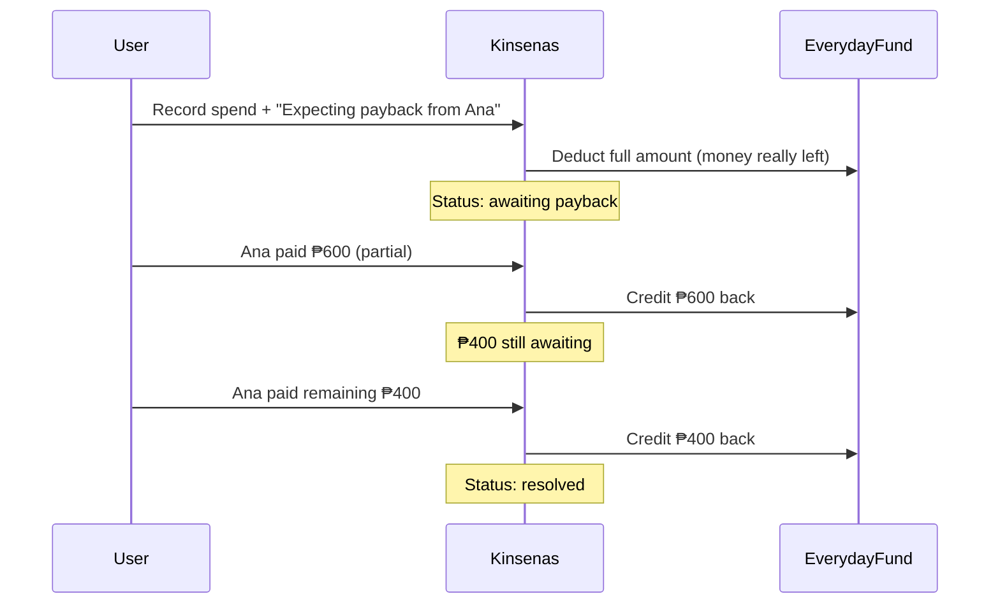

# Reimbursable spending (expecting payback)

## Problem

Users sometimes spend from a fund bucket (e.g. Everyday Fund) on behalf of someone else who will pay them back soon. This is **not debt** — it is temporary cash flow with a known payer. Today [`FundSpend`](app/Models/FundSpend.php) only supports confirmed/pending bank confirmation; there is no way to flag "money may return" or record payback without deleting/editing the spend.

**Target workflow:**



## Design decisions

| Topic | Choice | Rationale |
| ----- | ------ | --------- |
| Separate from bank `pending` | New reimbursement state, not `TransferStatus` | Existing `pending` means "confirm bank outflow"; payback is unrelated |
| Separate from Tier 2 debt | Fields + child ledger on `FundSpend` | User explicitly said not debt; avoid scope creep into [`tier-2-envelope-model-plan.md`](.cursor/plans/20260801-2112-tier-2-envelope-model-plan.md) debt section |
| Partial payback | Child `FundSpendReimbursement` rows | User chose partial support in v1; one row per payback event |
| Balance while awaiting | Full spend counts; each payback credits fund | Accurate cash position — envelope is short until money returns |
| Payback destination | Same fund as original spend (default, locked in v1) | Matches user example ("back to everyday fund") |
| Who will pay | Reuse [`Recipient`](app/Models/Recipient.php) via `expected_from_recipient_id` | Already on spend form; distinct from `recipient_id` (who was paid for the bill) |

## Data model

### Migration 1 — extend `fund_spends`

Add columns:

- `expects_reimbursement` — boolean, default `false`
- `expected_from_recipient_id` — nullable FK → `recipients`
- `reimbursement_closed_at` — nullable timestamp (user gave up waiting / write-off)

When `expects_reimbursement` is true, require `expected_from_recipient_id` on create/update.

### Migration 2 — new `fund_spend_reimbursements` table

| Column | Notes |
| ------ | ----- |
| `id` | UUID PK |
| `fund_spend_id` | FK → `fund_spends` |
| `savings_plan_id` | FK (denormalized for plan-scoped queries) |
| `category_id` | FK → same fund credited (v1: must match spend's category) |
| `amount_encrypted` | UserEncryptedMoney |
| `received_on` | date |
| `bank_id` | nullable FK (optional: which bank received cash) |
| `notes` | nullable string |
| `created_by_user_id` | FK → users |

Factory: `FundSpendReimbursementFactory`.

### Computed reimbursement status (not stored)

On [`FundSpend`](app/Models/FundSpend.php):

- **`none`** — `expects_reimbursement === false`
- **`awaiting`** — expecting, not closed, sum(reimbursements) `<` spend amount
- **`partial`** — sum `>` 0 and `<` spend amount (UI badge; can collapse with awaiting)
- **`resolved`** — sum(reimbursements) `>=` spend amount
- **`closed`** — `reimbursement_closed_at` set (no longer expecting remainder)

## Balance math

Update [`FundBalanceService`](app/Services/Savings/FundBalanceService.php):

```
effectiveSpent = confirmedSpends - reimbursementCredits
remaining = opening + allocated - transferredOut + receivedIn - effectiveSpent
```

New helper: `reimbursementCreditsByCategory()` — sum `fund_spend_reimbursements.amount` grouped by `category_id`.

Extend [`FundBalance`](resources/js/types/savings.ts) payload optionally with `awaitingReimbursement: string | null` per category (sum of unresolved expected amounts) for fund grid context.

**Guards:**

- `assertCanRecordReimbursement()` — spend must `expects_reimbursement`, not closed/resolved; amount must not exceed remaining owed
- Reimbursement does not bypass vault unlock (encrypted amounts)

## Backend

### New enum

[`app/Enums/ReimbursementStatus.php`](app/Enums/ReimbursementStatus.php) — `none`, `awaiting`, `resolved`, `closed` (computed helper on model/service).

### New service

[`app/Services/Savings/FundSpendReimbursementService.php`](app/Services/Savings/FundSpendReimbursementService.php):

- `record(FundSpend $spend, string $amount, string $receivedOn, ?string $bankId, ?string $notes, User $user)`
- `closeExpectation(FundSpend $spend)` — sets `reimbursement_closed_at` when user stops expecting remainder
- `totalsForSpend(FundSpend $spend): { received, remaining, status }`

### Extend existing services

[`FundSpendService::create/update`](app/Services/Savings/FundSpendService.php):

- Accept `expects_reimbursement`, `expected_from_recipient_id`
- Validate: if expecting, recipient required; cannot toggle off once reimbursements exist

[`FundSpendResource`](app/Http/Resources/FundSpendResource.php) + web controller props:

- `expectsReimbursement`, `expectedFromRecipientId`, `expectedFromRecipientName`
- `reimbursementStatus`, `reimbursedAmount`, `remainingOwed`
- `reimbursements[]` (id, amount, receivedOn, bankName, notes)

### Routes (web + API v1)

Under existing spending prefix in [`routes/savings.php`](routes/savings.php) and [`routes/api.php`](routes/api.php):

| Method | Path | Action |
| ------ | ---- | ------ |
| `POST` | `spending/{fundSpend}/reimbursements` | Record payback |
| `POST` | `spending/{fundSpend}/close-reimbursement` | Stop expecting remainder |

Controllers: extend [`FundSpendController`](app/Http/Controllers/Savings/FundSpendController.php) + [`SpendingController`](app/Http/Controllers/Api/V1/Savings/SpendingController.php).

Form requests: `RecordFundSpendReimbursementRequest`, extend `SaveFundSpendRequest` / `UpdateFundSpendRequest`.

### Dashboard

[`DashboardSummaryService`](app/Services/Dashboard/DashboardSummaryService.php):

- `awaitingReimbursementCount` — spends with status `awaiting`/`partial`
- `pendingActions.reimbursements` or extend existing panel with payback reminders (no confirm workflow — informational + link to spending page)

## Frontend (Inertia)

### Record spending

[`add-spending-modal.tsx`](resources/js/components/savings/add-spending-modal.tsx) + [`edit-spending-modal.tsx`](resources/js/components/savings/edit-spending-modal.tsx):

- Checkbox: **"Expecting payback"**
- When checked: required select **"Who will pay you back?"** (recipients list, separate from optional "Recipient" paid-to field)
- Helper copy: *"Fund balance drops now. Record payback when you receive it."*

### Spending list

[`spending/index.tsx`](resources/js/pages/savings/spending/index.tsx):

- Badge per row: `Awaiting payback`, `Partially repaid (₱X/₱Y)`, `Resolved`, `Closed`
- Filter chips: All | Awaiting payback | Resolved (extends Tier 1 filter todo pattern)
- Actions on awaiting/partial rows:
  - **Record payback** → new modal
  - **Stop expecting** (if partial or zero paybacks yet)

### New modal

[`record-payback-modal.tsx`](resources/js/components/savings/record-payback-modal.tsx):

- Amount (default = remaining owed), date, optional bank, optional note
- Shows original spend context (fund, description, expected from)

### Fund balance grid

[`fund-balance-grid.tsx`](resources/js/components/savings/fund-balance-grid.tsx): optional subline under remaining — *"₱X awaiting payback"* when > 0.

### Types

Update [`resources/js/types/savings.ts`](resources/js/types/savings.ts) and [`packages/shared/src/types/savings.ts`](packages/shared/src/types/savings.ts) with reimbursement fields + `FundSpendReimbursement` type.

## Mobile (API parity)

Update [`apps/mobile/app/(app)/savings/spending.tsx`](apps/mobile/app/(app)/savings/spending.tsx) and related schema in [`apps/mobile/lib/schemas/spending-schema.ts`](apps/mobile/lib/schemas/spending-schema.ts) to surface badges and record-payback flow via API client.

## Impact matrix

| Area | Affected? | Notes |
| ---- | --------- | ----- |
| Database | Yes | 1 alter + 1 new table |
| Models | Yes | `FundSpend`, new `FundSpendReimbursement` |
| Balance service | Yes | Core formula change |
| Spending CRUD | Yes | New flags + validation |
| Dashboard | Yes | Awaiting count / actions |
| Reports | Minor | Spends still appear in recipient reports; reimbursed amounts stay linked to original spend |
| Seeders | N/A | Optional demo spend in existing seed — skip unless fresh-seed QA needed |
| Mobile | Yes | Spending screens + API types |
| Docs | N/A | Not requested |
| Conflicts | N/A | Does not overlap bank-pending or Tier 2 debt |

## Tests (TDD — suggest manual run)

Per [testing.mdc](.cursor/rules/testing.mdc), write failing tests first:

**Feature — [`tests/Feature/Savings/FundSpendReimbursementTest.php`](tests/Feature/Savings/FundSpendReimbursementTest.php)** (new):

- Create spend with expecting payback → balance reduced, status awaiting
- Partial payback → balance partially restored, remaining owed correct
- Full payback → status resolved, balance fully restored
- Over-payback rejected
- Close expectation → removed from awaiting count, balance unchanged
- Cannot disable expecting flag after reimbursements exist

**Feature — update [`tests/Feature/Savings/FundSpendTest.php`](tests/Feature/Savings/FundSpendTest.php)**:

- Validation: expecting payback requires expected-from recipient

**Feature — update [`tests/Feature/DashboardTest.php`](tests/Feature/DashboardTest.php)**:

- Dashboard includes awaiting reimbursement count

**API — [`tests/Feature/Api/V1/Savings/SpendingApiTest.php`](tests/Feature/Api/V1/Savings/SpendingApiTest.php)**:

- POST reimbursements endpoint

**Browser — [`tests/Browser/SpendingReimbursementTest.php`](tests/Browser/SpendingReimbursementTest.php)** (new):

- Record spend with expecting payback → record partial payback → see resolved badge

Suggested commands (manual):

```bash
php artisan test --compact tests/Feature/Savings/FundSpendReimbursementTest.php
php artisan test --compact tests/Feature/Savings/FundSpendTest.php
php artisan test --compact tests/Feature/DashboardTest.php
php artisan test --compact tests/Browser/SpendingReimbursementTest.php
vendor/bin/pint --dirty
```

## Out of scope (v1)

- Tier 2 formal debt module
- Payback to a **different** fund than the spend source
- Notifications/email for overdue payback (can add later)
- Exposing bank picker on all spends (optional follow-up; reimbursements can accept `bank_id` on payback record only)
- Income-period linkage ("treat payback as income") — payback credits envelope only

## User-facing copy (English)

| Internal | UI label |
| -------- | -------- |
| `expects_reimbursement` | Expecting payback |
| `expected_from_recipient_id` | Who will pay you back? |
| Record reimbursement | Record payback |
| `reimbursement_closed_at` | Stop expecting payback |
| Resolved | Paid back |

## Implementation order

1. Impact analysis + migration + models/factories
2. Failing Feature tests (reimbursement service + balance math)
3. `FundSpendReimbursementService` + balance updates
4. Extend spend create/update + new routes
5. Inertia UI (modal, list badges, payback modal)
6. Dashboard props
7. Shared types + mobile screens
8. Browser test + regression fixes
9. Full suite green (user runs manually)
