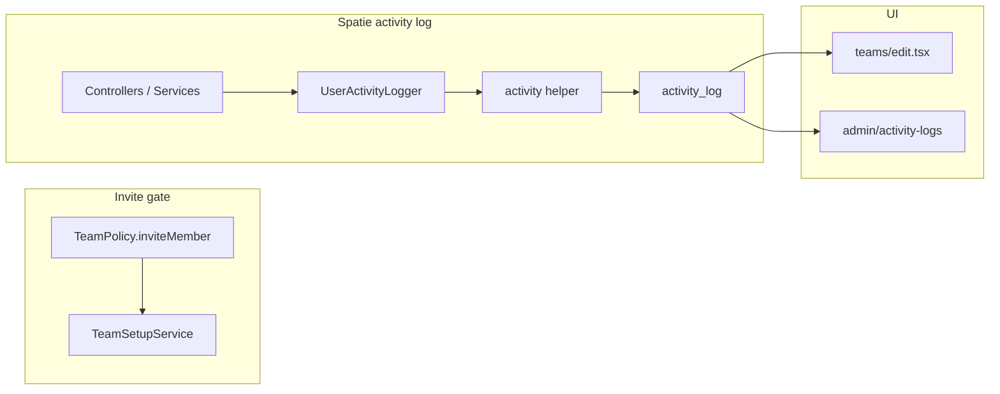

# Team invite setup gate + Spatie activity logging

## Decisions

| Topic | Choice | Implication |
| ----- | ------ | ----------- |
| Invite setup gate | Banks + plan + income only (no spending) | Reuse dashboard setup logic minus the spending step; spending checklist item stays for onboarding UX only |
| Activity logging | [`spatie/laravel-activitylog`](https://spatie.be/docs/laravel-activitylog/v5/introduction) | Standard `activity_log` table; thin `UserActivityLogger` wrapper for consistent events/properties; no custom audit table |
| Log visibility | Admin index + team-scoped feed on team edit | Platform admins query `Activity`; team owners/admins see recent team-scoped rows |
| Deleted invite rows | Log before hard delete | Cancel, decline, and prune retain actor + snapshot in `properties` JSON |
| UUID models | Customize published migration | `subject_id` / `causer_id` use UUID columns to match Kinsenas domain models |
| Privacy-first logging | Actions only — never amounts or encrypted fields | Central sanitizer strips forbidden keys; no Spatie model-event logging on financial models; descriptions name the action, not values |

## Current state

- Invites are authorized by role + subscription only ([`TeamPolicy::inviteMember`](app/Policies/TeamPolicy.php)); no setup check.
- Setup completeness lives only in [`DashboardSummaryService`](app/Services/Dashboard/DashboardSummaryService.php) (bank → plan → income → **spending**).
- Team actions leave sparse attribution (`invited_by`, membership timestamps) and hard-delete cancelled/declined/expired invites ([`TeamInvitationController`](app/Http/Controllers/Teams/TeamInvitationController.php)).
- No audit package or admin log UI exists.

## Architecture



### 1. Shared setup readiness (invite gate)

Add [`app/Services/Teams/TeamSetupService.php`](app/Services/Teams/TeamSetupService.php):

- `readinessForInvites(Team $team, User $user): TeamInviteReadiness` — returns `ready: bool` plus step list (bank, plan, income) with `complete`, `label`, `href` (same hrefs as dashboard).
- Criteria: `$team->banks()->exists()`, plan from `SavingsPlanService::forTeam($team, $user)`, `$plan->hasIncomePeriod()`.
- Refactor [`DashboardSummaryService`](app/Services/Dashboard/DashboardSummaryService.php) to delegate its setup steps to `TeamSetupService` so dashboard checklist and invite gate cannot drift.

**Enforcement**

- [`TeamPolicy::inviteMember`](app/Policies/TeamPolicy.php): role permission **and** `TeamSetupService::isReadyForInvites()`.
- [`CreateTeamInvitationRequest`](app/Http/Requests/Teams/CreateTeamInvitationRequest.php): validation error with actionable message when setup incomplete (403 alone is not enough for API clients).
- Mirror in [`Api\V1\Teams\TeamInvitationController`](app/Http/Controllers/Api/V1/Teams/TeamInvitationController.php).

**Frontend** ([`resources/js/pages/teams/edit.tsx`](resources/js/pages/teams/edit.tsx), [`invite-member-modal.tsx`](resources/js/components/invite-member-modal.tsx))

- New prop `inviteReadiness` from [`TeamController::edit`](app/Http/Controllers/Teams/TeamController.php).
- When user has invite role but `inviteReadiness.ready === false`: disable **Invite member** button, show tooltip/banner listing incomplete steps with links (mirror setup checklist copy).
- Add `data-test="invite-member-button"` / `data-test="invite-setup-blocked"` for browser test.

**Dashboard checklist** — unchanged four steps including spending; only the **invite gate** omits spending.

### 2. Spatie activity log

**Install & configure**

```bash
composer require spatie/laravel-activitylog
php artisan vendor:publish --provider="Spatie\Activitylog\ActivitylogServiceProvider" --tag="activitylog-migrations"
php artisan vendor:publish --provider="Spatie\Activitylog\ActivitylogServiceProvider" --tag="activitylog-config"
```

- Edit published migration: change `subject_id` and `causer_id` to **UUID** columns (Spatie docs note this for non-integer IDs).
- Set `config/activitylog.php`:
  - `'default_log_name' => 'kinsenas'`
  - `'delete_records_older_than_days' => 365` (retain audit trail one year; tune later)
  - Optional custom model: [`app/Models/Activity.php`](app/Models/Activity.php) extending `Spatie\Activitylog\Models\Activity` if we need typed helpers — otherwise use package model via config.
- **Do not** attach Spatie `LogsActivity` to financial models (`FundSpend`, `FundTransfer`, `IncomePeriod`, `FundAddedEntry`, `SavingsCategory`, etc.) — automatic logging would capture `changes` including encrypted amounts.
- `LogsActivity` is limited to non-financial models where safe (e.g. `Team` name changes, `Membership` role) with `logOnly(['name'])` / `logExcept([...])` and no amount fields.
- **Destructive flows** (invite cancel/decline/prune) use explicit logging before delete.

**Privacy-first rules (mandatory)**

Kinsenas is privacy-first. Activity logs answer **who did what**, not **how much**.

| Log | Do not log |
| --- | ---------- |
| Event + timestamp + causer | `amount`, `amount_encrypted`, `opening_balance_encrypted`, `balance`, centavos, percentages tied to money |
| Subject type + id (morph) | Decrypted or ciphertext values from vault/savings |
| Non-financial labels (role, team name, category name, bank name, plan name) | Passwords, tokens, vault passphrases, payment proof images |
| Action verbs in `description` (“Recorded spending”, “Created transfer”) | Numeric diffs in Spatie `changes` / `old` / `attributes` for money fields |

Add [`app/Services/Audit/ActivityPropertySanitizer.php`](app/Services/Audit/ActivityPropertySanitizer.php):

- Denylist keys (case-insensitive, prefix-aware): `amount`, `amount_encrypted`, `opening_balance_encrypted`, `balance`, `password`, `passphrase`, `secret`, `token`, `*_encrypted`, `old`, `attributes` when nested values are financial.
- `UserActivityLogger` runs **all** caller-supplied `properties` through the sanitizer before `withProperties()`; throw or log warning in tests if forbidden keys are passed (fail fast in dev/tests).
- Savings phase examples — allowed properties only:
  - `{ subject_type: FundSpend, subject_id, category_name, bank_name }` — **no amount**
  - `{ subject_type: FundTransfer, subject_id, from_category, to_category }` — **no amount**
  - `{ subject_type: IncomePeriod, subject_id, plan_name }` — **no amount**
- Admin/billing: log “payment submission approved” with submission id — **not** price paid or receipt metadata with amounts.

**Conventions (Kinsenas wrapper)**

Add [`app/Enums/UserActivityAction.php`](app/Enums/UserActivityAction.php) — machine-readable `event` values, e.g. `team.invitation.sent`, `team.invitation.cancelled`, `team.member.role_updated`, …

Add [`app/Services/Audit/UserActivityLogger.php`](app/Services/Audit/UserActivityLogger.php) — single entry point wrapping Spatie's `activity()` helper:

```php
public function log(
    UserActivityAction $action,
    string $description,
    ?User $causer = null,
    ?Model $subject = null,
    array $properties = [],
    ?Team $team = null,
): Activity
{
    return activity('kinsenas')
        ->event($action->value)
        ->when($causer, fn ($log) => $log->causedBy($causer))
        ->when($subject, fn ($log) => $log->performedOn($subject))
        ->withProperties($this->sanitizer->sanitize([
            ...$properties,
            'team_id' => $team?->id,
            'team_name' => $team?->name,
            'ip' => request()?->ip(),
            'user_agent' => Str::limit(request()?->userAgent() ?? '', 255),
        ]))
        ->log($description);
}
```

- Use human-readable `description` strings with Spatie placeholders where helpful (`:causer.name invited :properties.email`) — **never** include formatted money in descriptions.
- Store non-financial snapshots in `properties` (email, role labels, entity names) so log viewers work after subject rows are deleted; sanitizer enforces the denylist.
- Console prune job: set causer via `CauserResolver::setCauser()` or pass `causer: null` with `'source' => 'system'` in properties.

**Query patterns**

- Admin: `Activity::query()->where('log_name', 'kinsenas')->with(['causer', 'subject'])`
- Team edit feed: `->where('properties->team_id', $team->id)`
- Filter by action: `->where('event', UserActivityAction::TeamInvitationSent->value)`

**Instrumentation order (sequenced todos)**

| Phase | Surfaces | Key files |
| ----- | -------- | --------- |
| 1 — Team & invite | send, cancel, accept, decline, expire prune, role update, remove, leave, create/update/delete team, switch team | [`TeamInvitationController`](app/Http/Controllers/Teams/TeamInvitationController.php) (web + API), [`TeamMemberController`](app/Http/Controllers/Teams/TeamMemberController.php), [`TeamController`](app/Http/Controllers/Teams/TeamController.php), [`routes/console.php`](routes/console.php) prune command |
| 2 — Savings | banks, plans, income, spending, transfers, recipients, vault unlock | Savings controllers + services |
| 3 — Auth & settings | login, logout, register, password, profile, notification prefs | Fortify/API auth + settings controllers |
| 4 — Billing | payment submissions, subscription changes | Billing + admin subscriber controllers |
| 5 — Admin | beta approve/reject, payment review, platform user admin toggle/delete | `app/Http/Controllers/Admin/*` |

Each log call happens **after successful mutation**, **before** hard deletes (capture full invitation snapshot on cancel/decline/prune).

`UserActivityAction::label()` maps `event` → UI label; optional formatter for admin table rows.

### 3. Log viewers

**Admin** — [`AdminActivityLogController`](app/Http/Controllers/Admin/AdminActivityLogController.php)

- Route: `GET /admin/activity-logs` → [`resources/js/pages/admin/activity-logs/index.tsx`](resources/js/pages/admin/activity-logs/index.tsx)
- Add nav item in [`resources/js/lib/admin-nav.ts`](resources/js/lib/admin-nav.ts)
- Paginated table; filters: search (causer name/email), team (`properties->team_id`), event enum, date range
- Platform-admin middleware only (same as other admin routes)

**Team edit** — recent team-scoped feed (last 20) on [`teams/edit`](resources/js/pages/teams/edit.tsx) for users with `canUpdateTeam` or `canCreateInvitation`; props from `TeamController::edit`.

Out of scope for v1: member-facing global log page, export CSV, custom retention beyond Spatie config.

## Testing (TDD per [testing.mdc](.cursor/rules/testing.mdc))

| Layer | File | Coverage |
| ----- | ---- | -------- |
| Unit | `tests/Unit/Services/Teams/TeamSetupServiceTest.php` | Ready/not-ready permutations (bank, plan, income) |
| Unit | `tests/Unit/Services/Audit/UserActivityLoggerTest.php` | Creates `activity_log` row with event, causer, subject, properties |
| Unit | `tests/Unit/Services/Audit/ActivityPropertySanitizerTest.php` | Strips amount/encrypted keys; rejects nested `changes` with money |
| Feature | `tests/Feature/Teams/TeamInvitationSetupGateTest.php` | 403/422 when incomplete; success when bank+plan+income |
| Feature | extend [`tests/Feature/Teams/TeamInvitationTest.php`](tests/Feature/Teams/TeamInvitationTest.php) | Each invite action creates activity row; cancel/decline log before delete |
| Feature | `tests/Feature/Teams/TeamActivityLogTest.php` | Member role change, remove, leave logged |
| Feature | `tests/Feature/Admin/AdminActivityLogTest.php` | Admin index authorized; filters work |
| Feature | Phase 2+ smoke tests per domain | Savings log row exists; `properties` JSON contains no amount/balance keys |
| Browser | `tests/Browser/TeamInviteSetupGateTest.php` | Invite button disabled + setup message when incomplete; smoke when ready |

Use `assertDatabaseHas('activity_log', ['event' => ..., 'description' => ...])` and `Activity::latest()->first()` in tests.

Regression: update [`tests/Feature/DashboardTest.php`](tests/Feature/DashboardTest.php) if setup prop shape changes after refactor.

Run full suite before complete: `php artisan test --compact`.

## Files to create / touch (summary)

**New:** `TeamSetupService`, `TeamInviteReadiness` DTO, `UserActivityAction` enum, `UserActivityLogger`, `ActivityPropertySanitizer`, optional `Activity` model extension, admin controller + Inertia page, unit/feature/browser tests.

**Edit:** `composer.json` / `composer.lock`, published `config/activitylog.php`, `activity_log` migration (UUID morphs), `TeamPolicy`, `DashboardSummaryService`, team invitation/member controllers (web + API), `TeamController::edit` props, `teams/edit.tsx`, `admin-nav.ts`, `routes/admin.php`, console prune job, TypeScript types.

## Out of scope

- Custom `user_activity_logs` table (replaced by Spatie)
- Requiring spending for invites or changing dashboard checklist steps
- Retroactive backfill of historical actions
- Real-time log streaming / webhooks
- Member-visible app-wide activity feed outside team edit

## Verify checklist (post-implementation)

- `composer require spatie/laravel-activitylog` + `php artisan migrate`
- `vendor/bin/pint --dirty`
- `npm run build` (admin + team edit UI)
- Visual QA: team edit with incomplete setup → blocked invite; complete setup → invite works; admin **Activity logs** shows invite send/cancel/accept rows
- Spot-check a savings action log: description says action only; expand properties — no amount fields
