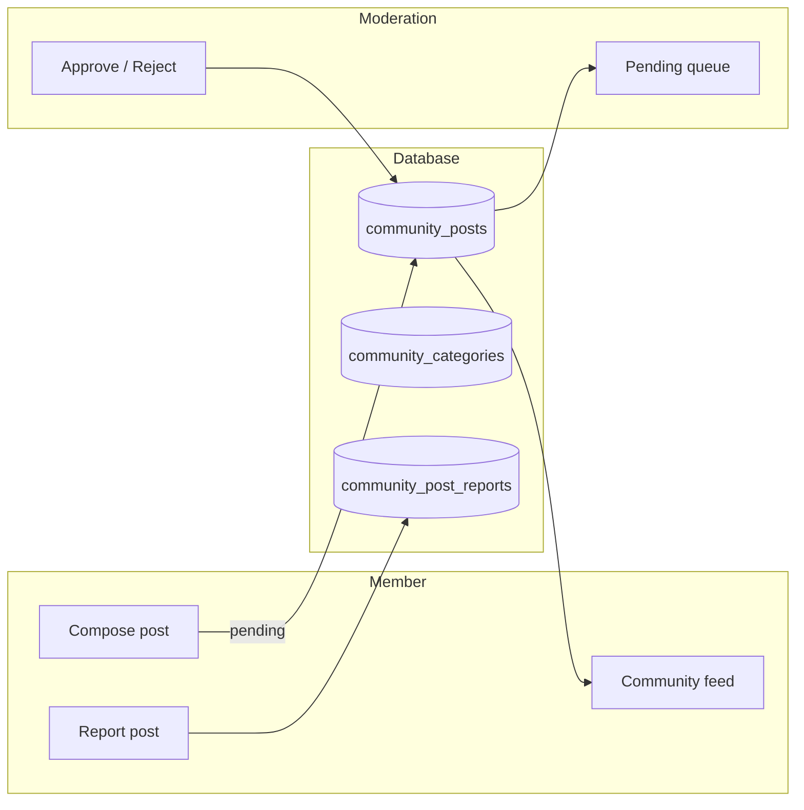

# Plan 3 — Community UGC

**Parent:** [education_content_cms Plan 1](file:///C:/Users/ruell/.cursor/plans/education_content_cms_2383b03d.plan.md) (Learn CMS)  
**After:** [Plan 2 — Side Hustle Library](./20260817-0454-side-hustle-library-plan.md) (shipped)

## Problem

Plans 1–2 are **staff-authored** Learn content. Members need a **community space** to share payday wins, side-hustle stories, and tips — with **moderation** before anything goes live, **profile photos** on bylines, and a way to **report** bad content.

Today:

- Only platform admins/authors publish via `content_posts`
- `LearnAccessService` gates full library read access
- Profile photos exist on `users.profile_photo_path` and show on editorial post bylines
- No member compose, no moderation queue, no community feed

## Target model (v1)



| Actor | Can do |
| ----- | ------ |
| **Guest** | No community access (member-only section in v1) |
| **Logged-in, no subscription** | Browse pending own drafts only; cannot publish to feed |
| **Subscribed member / open beta** | Submit posts → `pending`; view **approved** feed |
| **Platform admin** | Moderate queue, manage categories, dismiss reports |
| **Author role** | Same as member for community (no special publish bypass in v1) |

Reuse **[`LearnAccessService`](../../app/Services/Content/LearnAccessService.php)** for “full Learn access” on **read** of approved posts. **Compose** requires `auth` + `verified` + full Learn access (same as reactions).

---

## Decisions

| Topic | Recommendation | Implication | Confirm before RED |
| ----- | -------------- | ----------- | ------------------- |
| Storage | Dedicated `community_posts` table | Do not overload `content_posts` | **Locked** (parent plan) |
| Categories | `community_categories` admin CRUD | One category per post (v1) | **Locked** |
| Comments | **Defer to v1.1** | Posts only in v1 | Ask if comments required day one |
| Guest teasers | **None in v1** | `/learn/community` requires login | Ask if public teaser needed |
| Moderators | Platform admin only | Reuse `canManagePlatform()` | Ask if authors should moderate |
| Body format | TipTap HTML (like side hustles) | Reuse upload endpoint + `ContentBody` | **Locked** |
| Reactions | **Defer** | No helpful toggle on community posts v1 | Optional fast-follow |
| Post edit after submit | Member can edit **own pending** only | Re-submit stays pending | **Locked** |
| Slug URLs | `/learn/community/{slug}` | Separate from `/learn/posts/{slug}` | **Locked** |
| Learn hub tab | Add **Community** pill on unified Learn nav | Filter `?filter=community` or dedicated route | **Locked** |
| Profile photo | Author `profile_photo_path` on card + show | Reuse [`UserProfilePhoto`](../../app/Support/UserProfilePhoto.php), [`ContentByline`](../../resources/js/components/content/content-byline.tsx) | **Locked** |
| Cover image | Upload via existing [`AdminContentUploadController`](../../app/Http/Controllers/Admin/AdminContentUploadController.php) pattern | Hidden field `cover_image_url` on compose form | **Locked** |
| Rate limits | `throttle` on submit + report | e.g. 5 submits/hour, 10 reports/day | **Locked** |

Record user choices in this table before writing failing tests if any row differs from recommendation.

---

## Data model

All domain tables: **UUID PK** + `HasUuids`.

### `community_categories`

| Column | Notes |
| ------ | ----- |
| `id` | UUID PK |
| `name`, `slug` | Unique slug |
| `description` | Nullable |
| `sort_order` | Admin ordering |
| `status` | `draft`, `published` (mirror side hustle categories) |

### `community_posts`

| Column | Notes |
| ------ | ----- |
| `id` | UUID PK |
| `community_category_id` | FK, required |
| `user_id` | FK → `users` (author) |
| `title` | Required, max 255 |
| `slug` | Unique; generated from title + suffix on collision |
| `excerpt` | Optional short teaser for cards |
| `body` | TipTap HTML |
| `cover_image_url` | Nullable |
| `status` | `pending`, `published`, `rejected`, `withdrawn` |
| `rejection_reason` | Nullable; set when admin rejects |
| `published_at` | Set on approve |
| `moderated_by` | Nullable FK → `users` |
| `moderated_at` | Nullable timestamp |
| `created_at`, `updated_at` | |

Indexes: `(status, published_at)`, `(user_id, status)`, `(community_category_id)`.

**Not in v1:** `publish_scope` (member content is never public teaser), `post_as` override (always member name + photo).

### `community_post_reports`

| Column | Notes |
| ------ | ----- |
| `id` | UUID PK |
| `community_post_id` | FK |
| `reporter_id` | FK → `users` |
| `reason` | Enum: spam, harassment, misinformation, other |
| `details` | Nullable text, max 2000 |
| `status` | `open`, `dismissed`, `resolved` |
| `resolved_by` | Nullable FK → `users` |
| `resolved_at` | Nullable |

Unique: one **open** report per `(community_post_id, reporter_id)`.

---

## Backend

### Enums

- `CommunityPostStatus`: Pending, Published, Rejected, Withdrawn
- `CommunityCategoryStatus`: Draft, Published
- `CommunityReportReason`: Spam, Harassment, Misinformation, Other
- `CommunityReportStatus`: Open, Dismissed, Resolved
- Extend [`UserActivityAction`](../../app/Enums/UserActivityAction.php): `CommunityPostSubmitted`, `CommunityPostApproved`, `CommunityPostRejected`, `CommunityPostReported`

### Models & factories

- `CommunityCategory`, `CommunityPost`, `CommunityPostReport`
- Factories with realistic member authors (`User::factory()`)
- `CommunityPost` belongsTo `User`, `CommunityCategory`; scope `published()`, `pending()`, `forMember(User)`

### Services

| Service | Responsibility |
| ------- | -------------- |
| `CommunityPostService` | Create/update pending post; withdraw own pending; slug generation |
| `CommunityModerationService` | Approve (set published_at, moderator), reject (reason), list queue |
| `CommunityReportService` | File report, dismiss, resolve |

Validation highlights:

- Body required, sanitized HTML (same rules as content posts)
- Title required; excerpt optional
- Category must be `published`
- Cannot approve own post (moderator ≠ author)

### Policies

- `CommunityPostPolicy`: view published (any member with Learn access); view own pending; create/update own pending; withdraw own
- `CommunityCategoryPolicy`: admin CRUD platform only
- `CommunityPostReportPolicy`: create if authenticated; manage platform admin

### Controllers & routes

**Member** (`routes/web.php`, middleware `auth`, `verified`):

```
GET  /learn/community              → index (approved feed, category filter)
GET  /learn/community/mine         → member's pending + published
GET  /learn/community/create       → compose form
POST /learn/community              → store (pending)
GET  /learn/community/{post}/edit  → edit own pending
PUT  /learn/community/{post}       → update own pending
DELETE /learn/community/{post}     → withdraw (pending or published → withdrawn)
GET  /learn/community/{post}       → show (published, or own pending)
POST /learn/community/{post}/report → file report
```

**Admin** (`routes/admin-content.php`, `platform.admin`):

```
Resource: admin/content/community-categories
GET      admin/content/community-posts           → index (all statuses, filters)
GET      admin/content/community-posts/pending   → moderation queue
POST     admin/content/community-posts/{post}/approve
POST     admin/content/community-posts/{post}/reject
GET      admin/content/community-reports         → open reports
POST     admin/content/community-reports/{report}/dismiss
POST     admin/content/community-reports/{report}/resolve
```

### Presenters

- `CommunityPresenter::postSummary()` — title, slug, excerpt, category, author name, `authorAvatarUrl` via `UserProfilePhoto`, status, dates
- `CommunityPresenter::categorySummary()`

### Inertia props

Learn index optional: surface **latest 3 approved community posts** on `filter=all` (mirror hustle previews) — nice-to-have, can defer.

---

## Frontend

### Types

- `resources/js/types/community.ts` — mirrors presenter shapes

### Member pages (`resources/js/pages/learn/community/`)

| Page | Notes |
| ---- | ----- |
| `index.tsx` | Feed cards with category pills; uses `LearnNavTabs` + new **Community** tab |
| `mine.tsx` | My submissions with status badges |
| `create.tsx` | Title, category, excerpt, TipTap body, cover upload |
| `edit.tsx` | Same fields; pending only |
| `show.tsx` | Full body, `ContentByline` with avatar, report button, disclaimer footer |

### Admin pages (`resources/js/pages/admin/content/community-*`)

- Categories CRUD (mirror side hustle categories)
- Posts index with status filter
- **Moderation queue** — pending list with approve/reject modal (reason textarea)
- Reports index — dismiss / resolve

### Nav

- Extend [`learn-nav-tabs.tsx`](../../resources/js/components/learn/learn-nav-tabs.tsx): add `community` filter tab (members with full access only)
- Admin [`content-admin-tabs.tsx`](../../resources/js/components/admin/content-admin-tabs.tsx): Community categories, Community posts, Reports

### Shared components

- Reuse `CoverImageField`, `ContentBody`, `ContentByline`, TipTap on compose (member-facing editor — may need stripped toolbar vs admin)
- `ReportPostModal` with reason select + details

---

## Seeders

`CommunitySeeder` (called from `DatabaseSeeder` after users):

- Categories: **Payday wins**, **Side hustle stories**, **Tips & reminders**
- 2–3 **approved** sample posts (factory member author with profile photo)
- 1 **pending** post for moderation QA

---

## Tests (TDD order)

| Layer | File | Covers |
| ----- | ---- | ------ |
| Unit | `tests/Unit/Services/Content/CommunityModerationServiceTest.php` | Approve, reject, guard own-post |
| Feature | `tests/Feature/Admin/CommunityCategoryTest.php` | Admin CRUD |
| Feature | `tests/Feature/Admin/CommunityModerationTest.php` | Queue, approve, reject |
| Feature | `tests/Feature/Admin/CommunityReportTest.php` | Dismiss, resolve |
| Feature | `tests/Feature/Learn/CommunityPostTest.php` | Submit, pending, member cannot see others' pending |
| Feature | `tests/Feature/Learn/CommunityFeedTest.php` | Published feed, category filter, login required |
| Feature | `tests/Feature/Learn/CommunityReportTest.php` | Member reports, duplicate open report blocked |
| Browser | `tests/Browser/CommunityUgcTest.php` | Submit → admin approve → visible on Community tab |

**Regression:** `LearnIndexTest` / `PublicLearnTest` if Learn nav props change; `ProfilePhotoTest` unchanged.

---

## Impact matrix

| Area | Affected? | Notes |
| ---- | --------- | ----- |
| Database | Yes | 3 new tables |
| Models & factories | Yes | 3 models |
| Seeders | Yes | `CommunitySeeder` |
| Enums & permissions | Yes | Post/report statuses; admin only moderation |
| Routes & Wayfinder | Yes | Member + admin routes |
| Form requests | Yes | Store/update post, reject, report |
| Services | Yes | Post, moderation, report |
| Inertia props & TS | Yes | `community.ts`, Learn tab |
| UI components | Yes | Compose, feed, moderation queue |
| Settings / profile | No | Reuses existing photo |
| Print / export | N/A | |
| Change logs / audit | Yes | `UserActivityAction` + moderation log |
| Tests | Yes | Unit + Feature + Browser |
| Conflicts | See Decisions | Comments, guest access, moderators |
| Mobile | N/A | Deferred API |
| Docs | N/A | Not requested unless user asks |

---

## Out of scope (Plan 3 v1)

- Threaded **comments** (v1.1)
- **Helpful** reactions on community posts
- Guest/public teaser for community posts
- Full-text search
- Push notifications on approve
- Author-role moderation (platform admin only)
- RSS / SEO sitemap for community
- Mobile API (`packages/api-client`)
- Auto-approve trusted members
- Rich moderation (edit member body before publish)
- Trilingual UI

---

## Implementation phases

**Phase A — Foundation:** migrations, enums, models, factories, seeder, unit tests for moderation service.

**Phase B — Member compose & feed:** routes, policies, compose/edit, pending mine, published feed + show, Learn Community tab.

**Phase C — Admin moderation:** categories CRUD, queue, approve/reject, reports inbox.

**Phase D — Polish & tests green:** browser test, rate limits, activity logging, pint, wayfinder.

---

## Verify checklist (after ship)

```bash
php artisan migrate
php artisan db:seed --class=CommunitySeeder
php artisan wayfinder:generate --no-interaction
vendor/bin/pint --dirty
npm run build
```

**Visual QA:** Log in as member → Learn → Community → submit story → log in as platform admin → approve → confirm post on feed with author photo.

---

## Suggested commit (after implementation)

```
Summary: Add member community posts with moderation (Plan 3)

Members submit stories to Learn Community; platform admins approve via
queue. Separate community_posts tables, category feed, report flow, and
profile photos on bylines.
```
